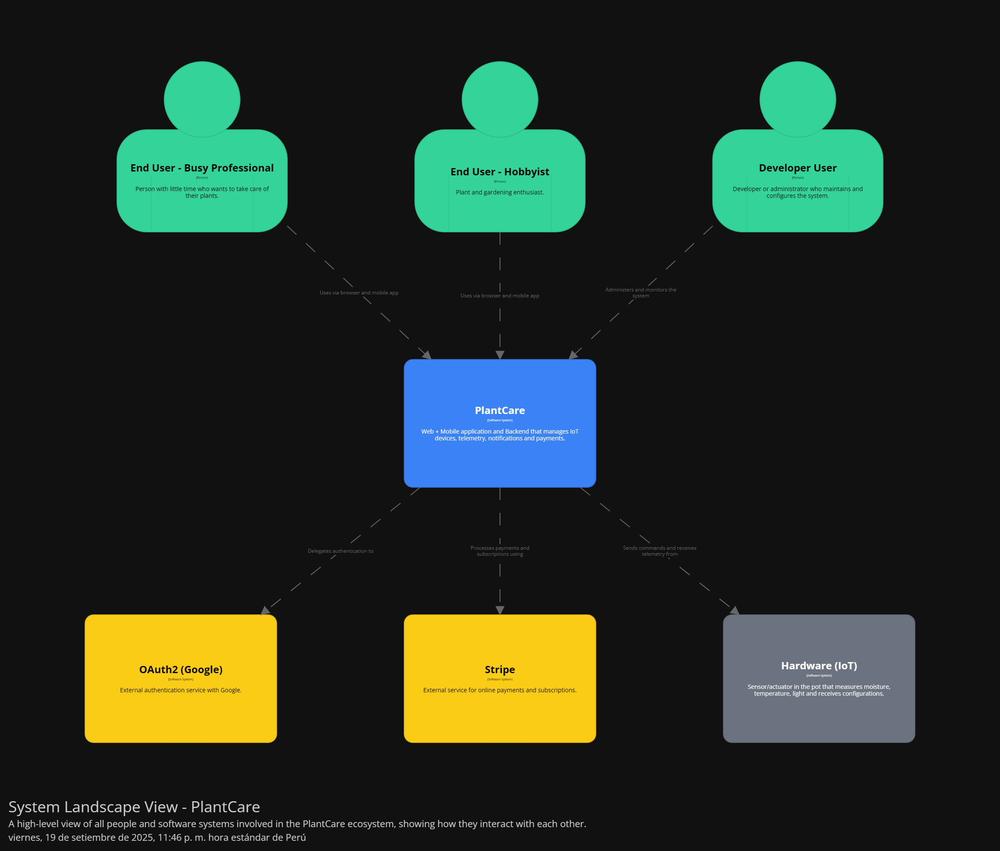
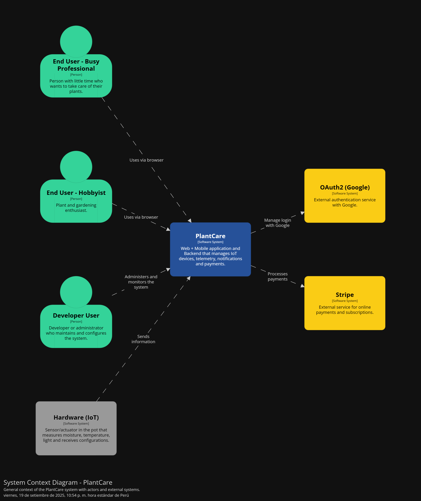
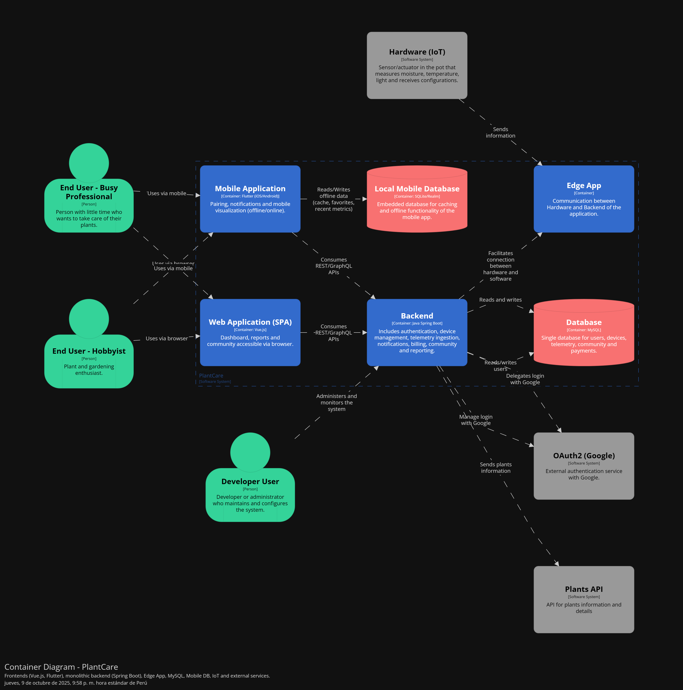

# Capítulo IV: Solution Software Design

## 4.1. Strategic-Level Domain-Driven Design.

En esta sección se presenta el proceso que seguimos para identificar y delimitar los bounded contexts de nuestro sistema. Para ello, aplicamos las técnicas de EventStorming y el Bounded Context Canvas, herramientas clave que nos permitieron mapear los dominios de negocio, descubrir fronteras naturales entre sus componentes y alinear la arquitectura con la estructura organizacional y los flujos de trabajo reales.

### 4.1.1. Design-Level EventStorming.

Para la elaboración del EventStorming, el equipo se organizó para encontrar una primera aproximación al
 modelado del dominio de nuestro proyecto. Durante este proceso seguimos una serie de 9 pasos

 **Paso 1: Collect Domain Events** En este primer paso, identificamos todos los eventos relevantes del dominio
 que ocurren en nuestro sistema. Estos eventos representan hechos importantes que suceden durante el
 proceso de negocio y los capturamos con post-its de color naranja

 

 **Paso 2: Timeline** Organizamos todos los eventos identificados en una línea temporal, colocándolos en orden
 cronológico para visualizar mejor el flujo del proceso y entender la secuencia natural de acciones en el
 sistema.

**Paso 3: Pain and Pivotal points** Identificamos los puntos problemáticos (pain points) y los momentos clave
 (pivotal points) en nuestro proceso. Estos representan áreas que requieren atención especial o que son críticas
 para el funcionamiento del sistema.

 **Paso 4: Commands** Agregamos los comandos (representados con post-its azules) que desencadenan los
 eventos. Estos comandos son las acciones que los usuarios o sistemas externos realizan para provocar
 cambios en el sistema

**Paso 5: Policies** Definimos las políticas o reglas de negocio (con post-its morados) que reaccionan a ciertos
 eventos y generan nuevos eventos como resultado. Estas políticas automatizan decisiones basadas en eventos
 previos.

**Paso 6: Read models**  Identificamos los modelos de lectura o vistas que los usuarios necesitan para tomar
 decisiones. Estos representan la información que debe estar disponible en determinados puntos del proceso.

 

  **Paso 7: External System** Marcamos los sistemas externos (con post-its rosados) que interactúan con nuestra
 solución. Estos son componentes fuera de nuestro control directo pero que tienen influencia en el proceso

**Paso 8: Aggregates** Agrupamos los comandos y eventos relacionados en unidades lógicas llamadas
 agregados (representados con post-its amarillos). Cada agregado encapsula un conjunto coherente de
 funcionalidades. 

 

  **Paso 9: Bounded Context** Finalmente, identificamos los contextos delimitados o bounded contexts, que son
 áreas de responsabilidad distintas dentro del sistema.

 
#### 4.1.1.1 Candidate Context Discovery.

 A partir del EventStorming realizado en Miro, nuestro equipo llevó a cabo una sesión de Candidate Context
 Discovery para identificar los bounded contexts de nuestra solución. Utilizamos principalmente la técnica
 look-for-pivotal-events durante la sesión.
 
 
 **Proceso de identificación**
 Comenzamos revisando el modelo completo que habíamos construido, prestando especial atención a los
 eventos pivote y agregados identificados

Detección de agrupaciones naturales: Identificamos patrones y agrupaciones naturales de comandos, eventos
 y políticas que trabajaban sobre las mismas entidades o procesos. 

 

 Una vez relacionado todo el event storming hacemos la agrupacion para infetificar y aplicar el contexto de los bouded context 

 **1. Start-with-Value**

Comenzamos identificando las áreas core del dominio, es decir, aquellas con mayor impacto en la propuesta de valor del sistema.

- Core: Plant Management, Device Management (IoT), Data Telemetry, Analytics.

- Supporting: Auth & Identity,  Subscription, Notification .

- generic: , Community.

**2.- Start-with-Simple**

Para no perdernos en la complejidad, descompusimos el flujo en pasos secuenciales simples, lo que permitió distinguir qué parte del sistema debía encargarse de cada responsabilidad.

**3.- Look-for-Pivotal-Events**
Identificamos eventos clave que marcaban transiciones entre subsistemas. Ejemplos:

- “Sensor data received” → frontera entre Device Management y Data Telemetry.

- “Subscription activated” → frontera entre Billing y Platform.

- “Rule triggered” → frontera entre Notification Engine y Plant Management.

__Primer agrupamiento__ 
Se delimitaron los contextos básicos de Auth & Identity y Device Management (IoT). Estos responden a responsabilidades claras: autenticación de usuarios y control de hardware. 

__Segundo agrupamiento__

Se aislaron los contextos centrales de negocio: Plant Management y Data Telemetry. Aquí ubicamos la lógica principal sobre cuidado y monitoreo de plantas.

__Tercer agrupamiento__ 

Se añadieron los contextos complementarios: Notification y Community, encargados de interacción y comunicación entre usuarios y el sistema.

Consolidación final
El resultado fue un mapa de 8 bounded contexts:

- Auth & Identity

- Device Management (IoT)

- Subscription

- Plant Management

- Data Telemetry

- Analytics

- Notification 

- Community 

Cada uno de ellos tiene responsabilidades y fronteras bien definidas, reduciendo la complejidad y facilitando la futura arquitectura basada en microservicios o módulos independientes.

#### 4.1.1.2 Domain Message Flows Modeling.

 Los Domain Message Flows modelan las interacciones entre los diferentes bounded contexts, mostrando
 cómo se comunican entre sí mediante comandos, eventos y consultas. A continuación, presentamos los flujos
 de mensaje para cuatro escenarios clave de nuestra aplicación:

 

 

 

 Estos flujos de mensaje son pilares fundamentales de la arquitectura del sistema, ya que revelan cómo los distintos Bounded Contexts se coordinan de forma coherente, asíncrona y bien definida. Al mapear cada comando, evento y consulta, no solo visualizamos el flujo de información entre componentes, sino que también identificamos puntos críticos de acoplamiento, posibles cuellos de botella en la comunicación y oportunidades para optimizar la escalabilidad y la resiliencia. Además, garantizan que la arquitectura esté alineada con los casos de uso del negocio, asegurando que cada interacción tenga propósito, trazabilidad y cumplimiento de contratos de dominio fundamentales para construir un sistema robusto, mantenible y adaptativo a largo plazo.

#### 4.1.1.3 Bounded Context Canvases.

 Los Bounded Context Canvases son herramientas visuales que nos permiten documentar las características
 fundamentales de cada contexto delimitado, capturando su propósito estratégico, modelo de dominio,
 lenguaje ubicuo, políticas y relaciones con otros contextos. A continuación, presentamos los canvases para
 nuestros cuatro bounded contexts identificados, que nos ayudaron a definir claramente las responsabilidades
 y límites de cada uno.

 

 

#### 4.1.2. Context Mapping.

En esta sección se explica y evidencia el proceso de elaboración de un conjunto de *context maps*, es decir, visualizaciones de las relaciones estructurales entre los **bounded contexts** identificados en el dominio. El equipo realizó una revisión de la información recolectada durante la fase de *EventStorming* y la utilizó para producir los diseños candidatos.  

El objetivo de este proceso es explorar y evaluar distintas configuraciones posibles de los bounded contexts y sus relaciones, considerando las buenas prácticas de **Domain-Driven Design (DDD)**.

#### 1. Revisión de la información recolectada
El equipo inició el trabajo revisando los resultados de la sesión de *EventStorming*. De ahí se obtuvieron los eventos de dominio, comandos y agregados que permitieron identificar las áreas del dominio más relevantes y con mayor valor para el negocio.  

Se discutió cómo estos elementos podrían agruparse en bounded contexts iniciales, considerando sus responsabilidades y las dependencias entre ellos.

#### 2. Preguntas exploratorias
Para evaluar diferentes alternativas de diseño, el equipo aplicó una serie de preguntas clave sugeridas en la literatura de DDD:

- **¿Qué pasaría si movemos este capability a otro bounded context?**  
  Esta pregunta permitió analizar la coherencia y consistencia de cada bounded context, evaluando si su alcance estaba correctamente delimitado.

- **¿Qué pasaría si descomponemos este capability y movemos uno de los sub-capabilities a otro bounded context?**  
  Con esto se exploró la posibilidad de dividir funcionalidades demasiado amplias y redistribuirlas de manera más balanceada.

- **¿Qué pasaría si partimos el bounded context en múltiples bounded contexts?**  
  En este caso se consideró si un contexto estaba asumiendo demasiadas responsabilidades y podía beneficiarse de ser subdividido.

- **¿Qué pasaría si tomamos este capability de estos 3 contexts y lo usamos para formar un nuevo context?**  
  Este análisis ayudó a detectar funcionalidades comunes y repetidas, abriendo la posibilidad de consolidarlas en un nuevo contexto especializado.

- **¿Qué pasaría si duplicamos una funcionalidad para romper la dependencia?**  
  Se evaluó la conveniencia de la duplicación estratégica para reducir el acoplamiento y mejorar la autonomía de ciertos equipos.

- **¿Qué pasaría si creamos un shared service para reducir la duplicación entre múltiples bounded contexts?**  
  Aquí se discutió el uso de un servicio compartido como estrategia para optimizar recursos sin comprometer demasiado la independencia de cada contexto.

- **¿Qué pasaría si aislamos los core capabilities y movemos los otros a un context aparte?**  
  Esta pregunta permitió identificar cuáles eran las capacidades centrales (*core domain*) y cuáles podían derivarse hacia contextos de soporte o genéricos.

#### 3. Diseño de mapas candidatos
Con base en las preguntas anteriores, se elaboraron diferentes *context maps* candidatos, cada uno reflejando una alternativa distinta de organización. Estos mapas mostraron cómo se podían distribuir las responsabilidades y qué relaciones se establecían entre los equipos o bounded contexts.

Se aplicaron **patrones de relaciones de contextos** descritos en DDD, entre ellos:

- **Open-Host Service:** aplicado en los contextos *Auth*, *Telemetry* y *Rules*, donde se expone un modelo o API pública para que otros contextos puedan integrarse.  
- **Conformist:** presente en la relación de *Auth* hacia *Platform*, donde este último debe alinearse sin posibilidad de imponer cambios.  
- **Anti-Corruption Layer (ACL):** usado entre *Platform* y *Billing*, permitiendo que el modelo de facturación no contamine al resto del sistema.  
- **Customer/Supplier:** visible en las relaciones de *Platform ↔ Billing*, *Telemetry → Analysis*, y *Plant → Analysis*, reflejando dependencias claras de consumidor/proveedor.  
- **Published Language:** aplicado en *Device ↔ Telemetry* y *Telemetry → Rules*, estandarizando los contratos de comunicación.  
- **Partnership:** en *Device ↔ Telemetry* y *Rules ↔ Device*, donde ambos contextos necesitan colaborar de manera cercana.  
- **Shared Kernel:** presente en *Community ↔ Platform*, donde ambos contextos comparten un subconjunto del modelo y deben coordinarse.  
- **Separate Ways:** también en *Community ↔ Platform*, indicando que ciertos aspectos se manejan de forma independiente para reducir el acoplamiento.  

#### 4. Aplicación de buenas prácticas en los context maps
Durante el proceso, el equipo consideró las siguientes buenas prácticas:  

- **Trabajar con context maps pequeños para preguntas explícitas:** cada mapa se diseñó con un propósito específico, evitando diagramas sobrecargados que generen confusión.  
- **Documentar y explicar los patrones usados:** se acompañaron los mapas con explicaciones claras de los patrones aplicados, de modo que los stakeholders pudieran entender su propósito.  
- **Usar múltiples perspectivas:** se generaron mapas diferentes para responder a distintas preguntas (ejemplo: dependencias técnicas, relaciones organizacionales, influencia entre equipos).  

#### Evidencia gráfica
Al finalizar, los mapas de contexto resultantes se documentaron en forma de diagramas visuales. Estos diagramas muestran tanto los **bounded contexts** como las relaciones entre ellos, junto con los patrones aplicados.  

Aquí se insertará la imagen del diagrama  exportado a formato gráfico:

### 4.1.3. Software Architecture.
Los diagramas de arquitectura de software nos ayudan a plantear el sistema de nuestro software, basándonos en el enfoque de desarrollo de Domain Driven Design.
#### 4.1.3.1. Software Architecture System Landscape Diagram.

Este diagrama representa todos los actores y sistemas del ecosistema PlantCare en un solo nivel: usuarios, PlantCare, servicios externos (Google OAuth2, Stripe), y el dispositivo IoT.

#### 4.1.3.2. Software Architecture Context Level Diagrams.

Este diagrama muestra el sistema PlantCare en su entorno, destacando las interacciones con los distintos usuarios (profesionales ocupados, aficionados y desarrolladores), los servicios externos (Google OAuth2 y Plants API) y el dispositivo IoT.

#### 4.1.3.2. Software Architecture Container Level Diagrams.

Detalla la arquitectura interna de PlantCare en términos de contenedores: aplicación web, aplicación móvil, backend, bases de datos (web y móvil) y la Edge App para el dispositivo IoT. También muestra cómo se conectan entre sí y con sistemas externos.

#### 4.1.3.3. Software Architecture Deployment Diagrams.

Describe cómo PlantCare se despliega en producción: servidores en la nube (Web Server, App Server, Database Server), dispositivos móviles de los usuarios y el dispositivo IoT físico. Cada contenedor está ubicado en el nodo correspondiente.

## 4.2. Tactical-Level Domain-Driven Design
En esta sección, el equipo aborda el diseño táctico de la solución siguiendo los principios de Domain‑Driven Design (DDD), traduciendo los Bounded Contexts previamente definidos en patrones y estructuras de código concretos. Cada subcapítulo se centra en uno de los contextos, describiendo sus agregados, repositorios, servicios de dominio y fábricas, así como las variantes y contratos que rigen su comportamiento interno. De este modo, se conecta la visión estratégica del dominio con decisiones de implementación precisas, garantizando que el software refleje fielmente las reglas de negocio y mantenga la coherencia del lenguaje ubicuo.

Para cada Bounded Context, se propone una arquitectura modular basada en capas tácticas, modelos de entidad, lógica de dominio, interfaces de infraestructura y adaptadores, y se aplican patrones de diseño. Además, se incluyen diagramas de clases. Este enfoque permite iterar rápidamente sobre el diseño interno sin perder alineación con los objetivos del negocio ni generar acoplamientos indebidos entre contextos (Ford et al., 2021).
## 4.2.1. Bounded Context: Auth&Identity

En la capa de dominio de Auth & Identity se definen las entidades, objetos de valor, agregados, servicios de dominio y repositorios encargados de gestionar el ciclo de vida de la autenticación e identidad de los usuarios. Aquí residen las reglas de negocio que garantizan la seguridad, consistencia y control de acceso de todo el sistema.

### 4.2.1.1. Domain Layer. 

En la capa de dominio de Auth & Identity se definen las entidades, objetos de valor, agregados, servicios de dominio y repositorios encargados de gestionar el ciclo de vida de la autenticación e identidad de los usuarios. Aquí residen las reglas de negocio que garantizan la seguridad, consistencia y control de acceso de todo el sistema.

**User Account**

| Propiedad     | Valor                                                                                 |
|---------------|---------------------------------------------------------------------------------------|
| **Nombre**    | UserAccount                                                                           |
| **Categoría** | Aggregate Root                                                                        |
| **Propósito** | Representar la cuenta de usuario registrada en el sistema, incluyendo credenciales,   |

**Atributos de UserAccount**

| Nombre   | Tipo de dato      | Visibilidad | Descripción                              |
|----------|-------------------|-------------|------------------------------------------|
| userId   | UserId            | Privada     | Identificador único de la cuenta         |
| FullName | FullName          | Privada     | Nombre completo del usuario              |
| Email    | Email             | Privada     | Dirección de correo electrónico          |
| Password | passwordHash      | Privada     | Hash de la contraseña                    |
| Status   | AccountStatus      | Privada     | Estado de la cuenta (activa, Desactiva) |
| CreatedAt | DateTime          | Privada     | Fecha de creación de la cuenta           |
| UpdatedAt | DateTime          | Privada     | Fecha de la última actualización         |

**Metodos de User Account**

| Nombre                | 	Tipo de retorno | 	Visibilidad	 | Descripción                                         |
|-----------------------|------------------|---------------|-----------------------------------------------------|
| VerifyEmail	          | void	            | public	       | Marca la cuenta como verificada tras código exitoso |
| ChangePassword        | 	void            | 	public       | 	Permite actualizar la contraseña                   |
| RequestPasswordReset	 | PasswordReset	   | public	       | Solicita un proceso de recuperación de contraseña   |
| UpdateProfile	        | void	            | public	       | Modifica nombre completo o email                    |
| Deactivate	           | void	            | public	| Desactiva la cuenta del usuario                     |
| Block	                | void             | public	| Bloquea la cuenta tras intentos fallidos            | 
| Activate	             | void	            | public	| Reactiva la cuenta si está suspendida               |

**UserId**

| Propiedad	| Valor |
|---------------|---------------------------------------------------------------------------------------|
| Nombre	| UserId |
| Categoría	| Value Object |
| Propósito	| Identificador único de usuario |

**Atributos de UserId**

| Nombre	| Tipo de dato	| Visibilidad	| Descripción |
|----------|--------------------|-------------|------------------------------------------|
| Value | Guid / Long	| private	| Identificador único numérico o GUID |

**EmailVerification**

| Propiedad	| Valor |
|---------------|---------------------------------------------------------------------------------------|
| Nombre	| EmailVerification | 
| Categoría	| Entity |
| Propósito	| Representar un proceso de verificación de correo electrónico. | 

**Atributos de EmailVerification**

| Nombre	| Tipo de dato	| Visibilidad	| Descripción |
|----------|--------------------|-------------|------------------------------------------|
| Code	| string	| private	| Código generado para verificación |
| UserId	| UserId	| private	| Usuario asociado | 
| ExpiresAt	| DateTime	| private	| Fecha de expiración del código |
| Verified	| bool	| private	| Indica si ya fue verificado |

**PasswordReset**

| Propiedad | Valor |
|---------------|---------------------------------------------------------------------------------------|
| Nombre |	PasswordReset |
| Categoría |	Entity |
| Propósito |	Representar un proceso de recuperación de contraseña solicitado por el usuario |.

**Atributos de PasswordReset**

| Nombre	                                | Tipo de dato	| Visibilidad	| Descripción |
|----------------------------------------|--------------------|-------------|------------------------------------------|
| Token	                                 | string	| private	| Código de recuperación |
| UserId	| UserId	| private	| Usuario asociado | 
| ExpiresAt	| DateTime	| private	| Fecha de expiración |
| Used	| bool	| private	| Marca si el token ya fue consumido |

**Session**

| Propiedad	| Valor |
|---------------|---------------------------------------------------------------------------------------|
|Nombre	| Session |
| Categoría	| Entity |
| Propósito	| Representar una sesión de usuario iniciada y autenticada. |

**Atributos de Session**

| Nombre	| Tipo de dato	| Visibilidad	 | Descripción                                  |
|----------|--------------------|--------------|----------------------------------------------|
| SessionId	| string	| private	     | Identificador de la sesión                   |
|UserId	| UserId	| private	| Usuario asociado                             |
| CreatedAt	| DateTime	| private	| Inicio de la sesión                          |
| ExpiresAt	| DateTime	| private	| Fecha de expiración                          |
| Revoked	| bool	| private	| Marca si la sesión fue cerrada o invalidada  |

**Domain Services**

**Authenticator**

| Propiedad	| Valor |
|---------------|---------------------------------------------------------------------------------------|
| Nombre	| Authenticator |
| Categoría	| Domain Service |
| Propósito	| Validar credenciales de usuario y emitir sesiones seguras. |

**Métodos de Authenticator**

| Nombre	| Tipo de retorno	| Visibilidad	| Descripción |
|-----------------------|------------------|---------------|-----------------------------------------------------|
| Authenticate	| Session	| public	| Autentica usuario y crea sesión |
| ValidateToken	| bool	| public	| Valida un token de sesión |
| RevokeSession	| void	| public	| Revoca sesión activa |

**Repositorios**

**IUserAccountRepository**

| Propiedad	| Valor                  |
|---------------|------------------------|
| Nombre	| IUserAccountRepository |
| Categoría	| Repository|
| Propósito	| Persistencia de cuentas de usuario|

**Métodos de IUserAccountRepository**

| Nombre	           | Tipo de retorno	 | Visibilidad	| Descripción|
|-------------------|------------------|---------------|-----------------------------------------------------|
| GetByIdAsync	     | UserAccount?	    | public	| Obtiene cuenta por Id|
| FindByEmailAsync	 | UserAccount?	| public	| Busca cuenta por correo|
| SaveAsync	        | UserAccount	| public	| Persiste cuenta|
| DeleteAsync	      | bool	| public	| Elimina lógicamente la cuenta|

**ISessionRepository**

| Propiedad	| Valor|
|---------------|------------------------|
| Nombre	| ISessionRepository| 
|Categoría	|Repository|
|Propósito	|Gestionar sesiones de usuario|

**Métodos de ISessionRepository**

|Nombre	|Tipo de retorno	|Visibilidad	|Descripción|
|-----------------------|------------------|---------------|-----------------------------------------------------|
|FindBySessionId	|Session?	|public	|Busca sesión por Id|
|Store	|void	|public|	Persiste nueva sesión|
|Revoke	|void	|public	|Revoca sesión|
|RevokeAllForUser	|void	|public	|Revoca todas las sesiones activas de un usuario|

### 4.2.1.2. Interface Layer. 

En la capa de interfaz del Bounded Context de Auth & Identity se definen los controladores REST que actúan como punto de entrada para solicitudes externas. Estos endpoints permiten a aplicaciones cliente (web, móviles, integraciones de terceros) interactuar con las funciones de registro, autenticación, recuperación de credenciales y gestión de perfil de usuario.
La interfaz está organizada en controladores especializados, cada uno con rutas y acciones bien definidas, garantizando simplicidad, seguridad y separación de responsabilidades.

**UserAccountController**

|Propiedad	|Valor|
|---------------|---------------------------------------------------------------------------------------|
|Nombre	|UserAccountController|
|Categoría	|Controller|
|Propósito	|Exponer endpoints para la gestión de cuentas de usuario|
|Ruta	|/api/users|

**Métodos de UserAccountController**

|Nombre	|Ruta	|Acción	|Handle|
|-----------------------|------------------|---------------|-----------------------------------------------------|
|GetById	|/{userId}	|Obtiene los datos de un usuario	|GetUserByIdQuery|
|UpdateProfile	|/{userId}/profile	|Actualiza nombre y email	|UpdateUserProfileCommand|
|ChangePassword	|/{userId}/password	|Cambia contraseña	|ChangeUserPasswordCommand|
|Deactivate	|/{userId}/deactivate	|Desactiva cuenta de usuario	|DeactivateUserCommand|
|Activate	|/{userId}/activate	|Reactiva cuenta suspendida	|ActivateUserCommand|
|Block	|/{userId}/block	|Bloquea cuenta tras intentos fallidos	|BlockUserCommand|

**AuthController**

|Propiedad	|Valor|
|---------------|---------------------------------------------------------------------------------------|
|Nombre	|AuthController|
|Categoría	|Controller|
|ropósito	|Gestiona registro, autenticación y sesiones de usuario|
|Ruta	|/api/auth|

**Métodos de AuthController**

|Nombre	|Ruta	|Acción	|Handle|
|-----------------------|------------------|---------------|-----------------------------------------------------|
|Register	|/register|Registra un nuevo usuario	|RegisterUserCommand|
|Verify	|/verify	|Valida código de verificación email	|VerifyEmailCommand|
|Login	|/login	|Inicia sesión, devuelve token	|LoginUserCommand|
|Logout	|/logout	|Revoca sesión activa	|RevokeSessionCommand|
|Refresh	|/refresh	|Renueva token de acceso	|RefreshTokenCommand|

**PasswordRecoveryController**

|Propiedad	|Valor|
|---------------|---------------------------------------------------------------------------------------|
|Nombre|	PasswordRecoveryController|
|Categoría	|Controller|
|Propósito	|Manejar procesos de recuperación de credenciales|
|Ruta	|/api/password|

**Métodos de PasswordRecoveryController**

|Nombre|	Ruta	|Acción	|Handle|
|-----------------------|------------------|---------------|-----------------------------------------------------|
|Request	|/forgot	|Solicita recuperación, envía código/email	|RequestPasswordResetCommand|
|VerifyCode	|/verify	|Valida el código de recuperación	|VerifyResetCodeCommand|
|Reset	|/reset	|Restablece contraseña	|ResetPasswordCommand|

**SessionController**

|Propiedad	|Valor|
|---------------|---------------------------------------------------------------------------------------|
|Nombre	|SessionController|
|Categoría|Controller|
|Propósito	|Gestionar sesiones activas de usuario|
|Ruta	|/api/sessions|

**Métodos de SessionController**

|Nombre	|Ruta	|Acción	|Handle|
|-----------------------|------------------|---------------|-----------------------------------------------------|
|GetActive	|/active/{userId}	|Obtiene sesiones activas de un usuario	|GetActiveSessionsQuery|
|Revoke	|/revoke/{sessionId}	|Revoca una sesión específica	|RevokeSessionCommand|
|RevokeAll	|/revokeAll/{userId}	|Revoca todas las sesiones del usuario	|RevokeAllSessionsCommand|

### 4.2.1.3. Application Layer. 

La capa de aplicación del Bounded Context Auth & Identity coordina la interacción entre la capa de interfaz y la capa de dominio. Su responsabilidad principal es orquestar comandos, consultas y eventos, asegurando la correcta ejecución de flujos como registro, autenticación, verificación, gestión de contraseñas, sesiones y cuentas de usuario.
No implementa reglas de negocio directamente, sino que delega al dominio, manteniendo así una separación clara de responsabilidades y asegurando la integridad transaccional del sistema.

**Command Handlers**

**UserRegisterCommandHandler**

|Propiedad	|Valor|
|---------------|---------------------------------------------------------------------------------------|
|Nombre	|UserRegisterCommandHandler|
|Categoría|	Command Handler|
|Propósito	|Registrar un usuario nuevo en el sistema|
|Comando	|RegisterUserCommand|

**UserVerifyEmailCommandHandler**

|Propiedad	|Valor|
|---------------|---------------------------------------------------------------------------------------|
|Nombre	|UserVerifyEmailCommandHandler|
|Categoría	|Command Handler|
|Propósito	|Validar código de verificación de email|
|Comando	|VerifyEmailCommand|

**UserLoginCommandHandler**

|Propiedad	|Valor|
|---------------|---------------------------------------------------------------------------------------|
|Nombre	|UserLoginCommandHandler|
|Categoría	|Command Handler|
|Propósito	|Iniciar sesión de un usuario|
|Comando	|LoginUserCommand|

**UserLogoutCommandHandler**

|Propiedad|	Valor|
|---------------|---------------------------------------------------------------------------------------|
|Nombre	|UserLogoutCommandHandler|
|Categoría	|Command Handler|
|Propósito	|Cerrar sesión de un usuario|
|Comando	|LogoutUserCommand|

**PasswordResetRequestCommandHandler**

|Propiedad	|Valor|
|---------------|---------------------------------------------------------------------------------------|
|Nombre	|PasswordResetRequestCommandHandler|
|Categoría	|Command Handler|
|Propósito	|Iniciar proceso de recuperación de contraseña|
|Comando	|RequestPasswordResetCommand|

**PasswordResetCommandHandler**

|Propiedad	|Valor|
|---------------|---------------------------------------------------------------------------------------|
|Nombre	|PasswordResetCommandHandler|
|Categoría|Command Handler|
|Propósito	|Restablecer contraseña de usuario|
|Comando	|ResetPasswordCommand|

**UserProfileUpdateCommandHandler**

|Propiedad|Valor|
|---------------|---------------------------------------------------------------------------------------|
| Nombre	|UserProfileUpdateCommandHandler|
|Categoría	|Command Handler|
|Propósito	|Actualizar datos de perfil de usuario|
|Comando	|UpdateUserProfileCommand|

**UserDeactivateCommandHandler**

|Propiedad	|Valor|
|---------------|---------------------------------------------------------------------------------------|
|Nombre	|UserDeactivateCommandHandler|
|Categoría	|Command Handler|
|Propósito	|Desactivar cuenta de usuario|
|Comando	|DeactivateUserCommand|

**UserBlockCommandHandler**

|Propiedad	|Valor|
|---------------|---------------------------------------------------------------------------------------|
|Nombre	|UserBlockCommandHandler|
|Categoría	|Command Handler|
|Propósito	|Bloquear cuenta tras intentos fallidos de inicio de sesión|
|Comando	|BlockUserCommand|

**Query Handlers**

**GetUserByIdQueryHandler**

|Propiedad	|Valor|
|---------------|---------------------------------------------------------------------------------------|
|Nombre	|GetUserByIdQueryHandler|
|Categoría	|Query Handler|
|Propósito|Obtener datos de un usuario por Id|
|Query	|GetUserByIdQuery|

**GetActiveSessionsQueryHandler**

|Propiedad	|Valor|
|---------------|---------------------------------------------------------------------------------------|
|Nombre	|GetActiveSessionsQueryHandler|
|Categoría	|Query Handler|
|Propósito	|Obtener sesiones activas de un usuario|
|Query	|GetActiveSessionsQuery|

**Event Handlers**

**RegisteredUserEventHandler**

|Propiedad|	Valor|
|---------------|---------------------------------------------------------------------------------------|
|Nombre|	RegisteredUserEventHandler|
|Categoría|	Event Handler|
|Propósito|Gestionar evento tras registro exitoso (ej. enviar verificación email)|
|Evento	|UserRegisteredEvent|

**UserVerifiedEventHandler**

|Propiedad	|Valor|
|---------------|---------------------------------------------------------------------------------------|
|Nombre	|UserVerifiedEventHandler|
|Categoría	|Event Handler|
|Propósito|	Gestionar acciones tras verificación de email exitosa|
|Evento	|UserVerifiedEvent|

**UserLoggedInEventHandler**

|Propiedad|	Valor|
|---------------|---------------------------------------------------------------------------------------|
|Nombre	|UserLoggedInEventHandler|
|Categoría	|Event Handler|
|Propósito|	Ejecutar acciones tras inicio de sesión exitoso (ej. auditoría)|
|Evento	|UserLoggedInEvent|

**UserLoggedOutEventHandler**

|Propiedad	|Valor|
|---------------|---------------------------------------------------------------------------------------|
|Nombre	|UserLoggedOutEventHandler|
|Categoría	|Event Handler|
|Propósito	|Ejecutar acciones tras cierre de sesión (ej. limpiar tokens)|
|Evento|	UserLoggedOutEvent|

**PasswordResetRequestedEventHandler**

|Propiedad	|Valor|
|---------------|---------------------------------------------------------------------------------------|
|Nombre	|PasswordResetRequestedEventHandler|
|Categoría	|Event Handler|
|Propósito	|Gestionar envío de email con código de recuperación|
|Evento	|PasswordResetRequestedEvent|

**PasswordResetCompletedEventHandler**

|Propiedad|	Valor|
|---------------|---------------------------------------------------------------------------------------|
|Nombre	|PasswordResetCompletedEventHandler|
|Categoría	|Event Handler|
|Propósito	|Gestionar acciones tras restablecimiento exitoso de contraseña|
|Evento|	PasswordResetCompletedEvent|

### 4.2.1.4. Infrastructure Layer. 
La capa de infraestructura del Bounded Context de Auth & Identity actúa como puente entre la lógica de negocio y los mecanismos técnicos de persistencia, seguridad y comunicación externa. Aquí se implementan las dependencias necesarias para la gestión de usuarios, autenticación y sesiones, garantizando la interacción confiable con bases de datos, proveedores de tokens y almacenamiento de credenciales.

Esta capa concreta las abstracciones definidas en el dominio a través de repositorios, contextos de base de datos y servicios técnicos. Su diseño asegura un desacoplamiento respecto a la lógica central, permitiendo reemplazar o evolucionar tecnologías sin alterar las reglas de negocio. Además, aporta eficiencia, escalabilidad y robustez en la gestión de identidades y accesos, alineándose con los objetivos funcionales y no funcionales del sistema.

**UserRepository**

|Propiedad	|Valor|
|---------------|---------------------------------------------------------------------------------------|
|Nombre|UserRepository|
|Categoría	|Repositorio|
|Propósito|	Persistir y consultar entidades de usuario|
|Interfaz	|IUserRepository|

**SessionRepository**

|Propiedad	|Valor|
|---------------|---------------------------------------------------------------------------------------|
|Nombre	|SessionRepository|
|Categoría	|Repositorio|
|Propósito	|Persistir y consultar entidades de sesión|
|Interfaz	|ISessionRepository|

**AuthDbContext**

|Propiedad	|Valor|
|---------------|---------------------------------------------------------------------------------------|
|Nombre|	AuthDbContext|
|Categoría	|ORM Context|
|Propósito	|Punto central de acceso a la base de datos para usuarios y sesiones|

### 4.2.1.5. Bounded Context Software Architecture ### Component Level Diagrams.

### 4.2.1.6. Bounded Context Software Architecture Code Level Diagrams.
#### 4.2.1.6.1. Bounded Context Domain Layer Class ### Diagrams. 

#### 4.2.1.6.2. Bounded Context Database Design Diagram.

## 4.2.2. Bounded Context: Plant Management
### 4.2.2.1. Domain Layer. 

En la capa de dominio de PlantProfile se definen las entidades, objetos de valor, agregados, servicios de dominio y repositorios encargados de gestionar el ciclo de vida de los perfiles de plantas. Aquí residen las reglas de negocio que garantizan la consistencia, trazabilidad y control del estado de cada planta en el sistema.

**PlantProfile**

|Propiedad|	Valor|
|---------------|---------------------------------------------------------------------------------------|
|Nombre	|PlantProfile|
|Categoría	|Aggregate Root|
|Propósito	|Representar el perfil de una planta registrada en el sistema, incluyendo su tipo, condiciones ideales y estado actual.|

**Atributos de PlantProfile**

|Nombre	|Tipo de dato	|Visibilidad	|Descripción|
|---------------|---------------|---------------|---------------|
|plantProfileId	|PlantProfileId	|Privada	|Identificador único del perfil|
|plantType	|PlantType	|Privada	|Tipo de planta (ej. cactus, orquídea)|
|conditions	|PlantConditions	|Privada	|Condiciones ideales configuradas|
|currentState	|PlantState	|Privada	|Estado actual de la planta|
|status	|ProfileStatus	|Privada	|Estado del perfil (activo, archivado, eliminado)|
|createdAt	|DateTime	|Privada	|Fecha de creación|
|archivedAt	|DateTime?	|Privada	|Fecha de archivado (si aplica)|

**Métodos de PlantProfile**

|Nombre	|Tipo de retorno	|Visibilidad	|Descripción|
|-----------------------|------------------|---------------|-----------------------------------------------------|
|ConfigureConditions	|void	|public	|Configura condiciones ideales de la planta|
|UpdateState	|void	|public	|Actualiza el estado de la planta|
|Archive	|void	|public	|Archiva el perfil de la planta|
|Delete	|void	|public	|Elimina definitivamente el perfil|
|Restore	|void	|public	|Restaura un perfil archivado|

**Value Objects**

**PlantProfileId**

| Propiedad	|Valor|
|---------------|---------------------------------------------------------------------------------------|
|Nombre	|PlantProfileId|
|Categoría |Value Object|
|Propósito |Identificador único del perfil de planta|

**Atributos de PlantProfileId**

|Nombre	|Tipo de dato	|Visibilidad	|Descripción|
|----------|--------------------|-------------|------------------------------------------|
|value	|Guid / Long	|private	|Identificador único numérico o GUID|

**PlantType**

| Propiedad	| Valor|
|-------------|---------------------------------------------------------------------------------------|
|Nombre| PlantType|
|Categoría |Value Object|
|Propósito |Representar el tipo de planta seleccionada (ej. cactus, orquídea).|

**PlantConditions**

| Propiedad | Valor|
|--------------|---------------------------------------------------------------------------------------|
|Nombre |PlantConditions|
|Categoría |Value Object|
|Propósito| Conjunto de condiciones ideales configuradas para el crecimiento de la planta.|

Atributos: temperatura, humedad, luz, riego.

**PlantState**

| Propiedad	| Valor|
|--------------|---------------------------------------------------------------------------------------|
|Nombre	|PlantState|
|Categoría| Value Object|
|Propósito|Estado actual de la planta (ej. saludable, en riesgo, muerta).|

**ProfileStatus**

| Propiedad	 | Valor|
|------------|---------------------------------------------------------------------------------------|
| Nombre	    |ProfileStatus|
|Categoría |Value Object|
|Propósito| Representar el estado del perfil (activo, archivado, eliminado).|

**Entidades auxiliares**

**PlantHistory**

|Propiedad|Valor|
|---------------|---------------------------------------------------------------------------------------|
|Nombre	|PlantHistory|
|Categoría| Entity|
|Propósito |Registrar cambios históricos de estado o condiciones en una planta.|

Atributos:

historyId

plantProfileId

eventType (estado actualizado, condiciones cambiadas, archivado, eliminado)

occurredAt

**Domain Services**
**PlantLifecycleManager**

|Propiedad	|Valor|
|---------------|---------------------------------------------------------------------------------------|
|Nombre	|PlantLifecycleManager|
|Categoría|	Domain Service|
|Propósito	|Gestionar reglas de negocio sobre el ciclo de vida de una planta (ej. eliminación tras 30 días de archivado).|

**Métodos de PlantLifecycleManager**

|Nombre	|Tipo de retorno	|Visibilidad	|Descripción|
|-----------------------|------------------|---------------|-----------------------------------------------------|
|CheckArchiveExpiration	|bool	|public|	Verifica si una planta archivada debe eliminarse|
|ApplyStateRules	|void	|public	|Aplica reglas de negocio según estado de la planta|

**Repositorios
IPlantProfileRepository**

|Propiedad	|Valor|
|---------------|---------------------------------------------------------------------------------------|
|Nombre	|IPlantProfileRepository|
|Categoría	|Repository|
|Propósito	|Persistencia de perfiles de planta|

**Métodos de IPlantProfileRepository**

|Nombre	|Tipo de retorno	|Visibilidad	|Descripción|
|-----------------------|------------------|---------------|-----------------------------------------------------|
|GetByIdAsync	|PlantProfile?|	public|	Obtiene perfil por Id|
|SaveAsync	|PlantProfile	|public	|Persiste perfil|
|DeleteAsync	|bool	|public|	Elimina perfil|
|ArchiveAsync|	bool	|public	|Archiva perfil|

**IPlantHistoryRepository**

|Propiedad|	Valor|
|---------------|---------------------------------------------------------------------------------------|
|Nombre	|IPlantHistoryRepository|
|Categoría	|Repository|
|Propósito	|Gestionar registros históricos de perfiles de planta|

**Métodos de IPlantHistoryRepository**

|Nombre	|Tipo de retorno	|Visibilidad	|Descripción|
|-----------------------|------------------|---------------|-----------------------------------------------------|
|LogEvent	|void	|public|	Registra un evento en el historial|
|GetHistory	|List<PlantHistory>|	public|	Obtiene historial de un perfil de planta|

### 4.2.2.2. Interface Layer. 

En la capa de interfaz del Bounded Context Plant Management se definen los controladores REST que actúan como punto de entrada para solicitudes externas. Estos endpoints permiten a aplicaciones cliente (web, móviles, integraciones con sensores o APIs externas) interactuar con las funciones de creación de perfiles de planta, gestión de estado, configuración de condiciones ideales, archivado y eliminación.

La interfaz está organizada en controladores especializados, cada uno con rutas y acciones bien definidas, garantizando simplicidad, seguridad y separación de responsabilidades.

**PlantProfileController**

|Propiedad	|Valor|
|---------------|---------------------------------------------------------------------------------------|
|Nombre	|PlantProfileController|
|Categoría	|Controller|
|Propósito	|Exponer endpoints para la creación, consulta, actualización, archivado y eliminación de perfiles de plantas.|
|Ruta	|/api/plants|

**Métodos de PlantProfileController**

|Nombre	|Ruta	|Acción	|Handle|
|-----------------------|------------------|---------------|-----------------------------------------------------|
|Create	|/	|Crea un nuevo perfil de planta	|CreatePlantProfileCommand|
|GetById	|/{plantId}	|Obtiene los datos de un perfil de planta	|GetPlantProfileByIdQuery|
|Update	|/{plantId}	|Actualiza datos generales de la planta	|UpdatePlantProfileCommand|
|Archive	|/{plantId}/archive	|Archiva el perfil de una planta	|ArchivePlantProfileCommand|
|Delete	|/{plantId}	|Elimina definitivamente un perfil de planta	|DeletePlantProfileCommand|

**PlantStatusController**

|Propiedad	|Valor|
|---------------|---------------------------------------------------------------------------------------|
|Nombre	|PlantStatusController|
|Categoría	|Controller|
|Propósito	|Gestionar el estado de las plantas (ej. salud, crecimiento, últimas mediciones).|
|Ruta	|/api/plants/{plantId}/status|

**Métodos de PlantStatusController**

|Nombre	|Ruta	|Acción	|Handle|
|-----------------------|-----------------|---------------|-----------------------------------------------------|
|UpdateStatus	|/update	|Actualiza el estado actual de la planta	|UpdatePlantStatusCommand|
|GetStatus|	/	|Obtiene el estado actual de la planta	|GetPlantStatusQuery|
|GetHistory|	/history	|Devuelve el historial de cambios de estado	|GetPlantHistoryQuery|

**PlantConditionsController**

|Propiedad	|Valor|
|---------------|---------------------------------------------------------------------------------------|
|Nombre	|PlantConditionsController|
|Categoría	|Controller|
|Propósito	|Configurar y consultar las condiciones ideales de una planta (riego, luz, temperatura).|
|Ruta	|/api/plants/{plantId}/conditions|

**Métodos de PlantConditionsController**

|Nombre|	Ruta	|Acción	|Handle|
|-----------------------|------------------|---------------|-----------------------------------------------------|
|Configure	|/	|Define condiciones ideales de la planta	|ConfigurePlantConditionsCommand|
|GetConditions|	/	|Consulta condiciones configuradas|	GetPlantConditionsQuery|

**ExternalPlantApiController**

|Propiedad	|Valor|
|---------------|---------------------------------------------------------------------------------------|
|Nombre|	ExternalPlantApiController|
|Categoría	|Controller|
|Propósito	|Integrarse con API externa de plantas para obtener información de referencia (tipos de planta, cuidados, recomendaciones).|
|Ruta	|/api/external/plants|

**Métodos de ExternalPlantApiController**

|Nombre	|Ruta	|Acción|	Handle|
|-----------------------|------------------|---------------|-----------------------------------------------------|
|Search	|/search?name={plantName}	|Busca información de una planta en API externa|	SearchExternalPlantQuery|
|GetDetails	|/details/{externalPlantId}|	Obtiene detalles desde API externa	|GetExternalPlantDetailsQuery|

### 4.2.2.3. Application Layer. 

La capa de aplicación del Bounded Context Plant Management coordina la interacción entre la capa de interfaz y la capa de dominio. Su responsabilidad principal es orquestar comandos, consultas y eventos, asegurando la correcta ejecución de flujos como la creación de perfiles de plantas, actualización de estados, configuración de condiciones ideales, archivado y eliminación.

No implementa reglas de negocio directamente, sino que delega al dominio, manteniendo una separación clara de responsabilidades y asegurando la integridad transaccional del sistema.

**Command Handlers**
**CreatePlantProfileCommandHandler**

|Propiedad|Valor|
|---------------|---------------------------------------------------------------------------------------|
|Nombre	|CreatePlantProfileCommandHandler|
|Categoría	|Command Handler|
|Propósito	|Crear un nuevo perfil de planta en el sistema|
|Comando	|CreatePlantProfileCommand|

**UpdatePlantProfileCommandHandler**

|Propiedad|	Valor|
|---------------|---------------------------------------------------------------------------------------|
|Nombre	|UpdatePlantProfileCommandHandler|
|Categoría	|Command Handler|
|Propósito	|Actualizar los datos generales del perfil de planta|
|Comando	|UpdatePlantProfileCommand|

**ArchivePlantProfileCommandHandler**

|Propiedad	|Valor|
|---------------|---------------------------------------------------------------------------------------|
|Nombre	|ArchivePlantProfileCommandHandler|
|Categoría	|Command Handler|
|Propósito	|Archivar un perfil de planta activo|
|Comando	|ArchivePlantProfileCommand|

**DeletePlantProfileCommandHandler**

|Propiedad|	Valor|
|---------------|---------------------------------------------------------------------------------------|
|Nombre|	DeletePlantProfileCommandHandler|
|Categoría	|Command Handler|
|Propósito	|Eliminar un perfil de planta (definitivamente o tras periodo de archivo)|
|Comando	|DeletePlantProfileCommand|

**UpdatePlantStatusCommandHandler**

|Propiedad	|Valor|
|---------------|---------------------------------------------------------------------------------------|
|Nombre	|UpdatePlantStatusCommandHandler|
|Categoría	|Command Handler|
|Propósito	|Actualizar el estado actual de una planta (ej. salud, humedad, crecimiento)|
|Comando	|UpdatePlantStatusCommand|

**ConfigurePlantConditionsCommandHandler**

|Propiedad	|Valor|
|---------------|---------------------------------------------------------------------------------------|
|Nombre	|ConfigurePlantConditionsCommandHandler|
|Categoría	|Command Handler|
|Propósito	|Configurar las condiciones ideales de una planta (riego, luz, temperatura, nutrientes)|
|Comando	|ConfigurePlantConditionsCommand|

**Query Handlers**
**GetPlantProfileByIdQueryHandler**

|Propiedad	|Valor|
|---------------|---------------------------------------------------------------------------------------|
|Nombre	|GetPlantProfileByIdQueryHandler|
|Categoría	|Query Handler|
|Propósito	|Obtener datos de un perfil de planta por Id|
|Query	|GetPlantProfileByIdQuery|

**GetPlantStatusQueryHandler**

|Propiedad	|Valor|
|---------------|---------------------------------------------------------------------------------------|
|Nombre	|GetPlantStatusQueryHandler|
|Categoría	|Query Handler|
|Propósito|	Obtener el estado actual de una planta|
|Query	|GetPlantStatusQuery|

**GetPlantHistoryQueryHandler**

|Propiedad	|Valor|
|---------------|---------------------------------------------------------------------------------------|
|Nombre|	GetPlantHistoryQueryHandler|
|Categoría	|Query Handler|
|Propósito	|Consultar el historial de cambios de estado de una planta|
|Query|	GetPlantHistoryQuery|

**GetPlantConditionsQueryHandler**

|Propiedad	|Valor|
|---------------|---------------------------------------------------------------------------------------|
|Nombre	|GetPlantConditionsQueryHandler|
|Categoría	|Query Handler|
|Propósito	|Obtener las condiciones ideales configuradas de una planta|
|Query	|GetPlantConditionsQuery|

**SearchExternalPlantQueryHandler**

|Propiedad	|Valor|
|---------------|---------------------------------------------------------------------------------------|
|Nombre	|SearchExternalPlantQueryHandler|
|Categoría	|Query Handler|
|Propósito	|Buscar información de una planta en la API externa|
|Query	|SearchExternalPlantQuery|

**GetExternalPlantDetailsQueryHandler**

|Propiedad	|Valor|
|---------------|---------------------------------------------------------------------------------------|
|Nombre	|GetExternalPlantDetailsQueryHandler|
|Categoría	|Query Handler|
|Propósito	|Obtener detalles de una planta desde API externa|
|Query	|GetExternalPlantDetailsQuery|

**Event Handlers**
**PlantProfileCreatedEventHandler**

|Propiedad	|Valor|
|---------------|---------------------------------------------------------------------------------------|
|Nombre	|PlantProfileCreatedEventHandler|
|Categoría	|Event Handler|
|Propósito	|Gestionar acciones tras la creación de un perfil de planta (ej. notificar al usuario, inicializar condiciones)|
|Evento	|PlantProfileCreatedEvent|

**PlantStatusUpdatedEventHandler**

|Propiedad	|Valor|
|---------------|---------------------------------------------------------------------------------------|
|Nombre	|PlantStatusUpdatedEventHandler|
|Categoría	|Event Handler|
|Propósito	|Gestionar acciones tras actualización de estado (ej. registrar historial, disparar alertas)|
|Evento	|PlantStatusUpdatedEvent|

**PlantConditionsConfiguredEventHandler**

|Propiedad	|Valor|
|---------------|---------------------------------------------------------------------------------------|
|Nombre	|PlantConditionsConfiguredEventHandler|
|Categoría|	Event Handler|
|Propósito	|Gestionar acciones tras la configuración de condiciones ideales (ej. vincular con sensores IoT)|
|Evento	|PlantConditionsConfiguredEvent|

**PlantProfileArchivedEventHandler**

|Propiedad	|Valor|
|---------------|---------------------------------------------------------------------------------------|
|Nombre|	PlantProfileArchivedEventHandler|
|Categoría	|Event Handler|
|Propósito	|Ejecutar acciones tras archivar un perfil (ej. programar eliminación en 30 días)|
|Evento	|PlantProfileArchivedEvent|

**PlantProfileDeletedEventHandler**

|Propiedad	|Valor|
|---------------|---------------------------------------------------------------------------------------|
|Nombre	|PlantProfileDeletedEventHandler|
|Categoría	|Event Handler|
|Propósito	|Gestionar acciones tras la eliminación de un perfil (ej. limpiar registros relacionados)|
|Evento	|PlantProfileDeletedEvent|

### 4.2.2.4. Infrastructure Layer. 

La capa de infraestructura del Bounded Context Plant Management actúa como puente entre la lógica de negocio y los mecanismos técnicos de persistencia, integración con API externas y comunicación con servicios de sensores o monitoreo ambiental.

Aquí se implementan las dependencias necesarias para la gestión de perfiles de plantas, condiciones configuradas, estados e historial, garantizando la interacción confiable con bases de datos y proveedores externos de información botánica.

Esta capa concreta las abstracciones definidas en el dominio a través de repositorios, contextos de base de datos y servicios técnicos. Su diseño asegura un desacoplamiento respecto a la lógica central, permitiendo reemplazar o evolucionar tecnologías sin alterar las reglas de negocio. Además, aporta eficiencia, escalabilidad y robustez en la gestión del ciclo de vida de las plantas dentro del sistema.

**Repositorios**
**PlantProfileRepository**

|Propiedad	|Valor|
|---------------|---------------------------------------------------------------------------------------|
|Nombre|	PlantProfileRepository|
|Categoría	|Repositorio|
|Propósito	|Persistir y consultar entidades de perfiles de plantas|
|Interfaz	|IPlantProfileRepository|

**PlantStatusRepository**

|Propiedad	|Valor|
|---------------|---------------------------------------------------------------------------------------|
|Nombre	|PlantStatusRepository|
|Categoría	|Repositorio|
|Propósito	|Persistir y consultar estados actuales de las plantas|
|Interfaz	|IPlantStatusRepository|

**PlantHistoryRepository**

|Propiedad	|Valor|
|---------------|---------------------------------------------------------------------------------------|
|Nombre	|PlantHistoryRepository|
|Categoría	|Repositorio|
|Propósito	|Almacenar y recuperar el historial de cambios de estado de las plantas|
|Interfaz	|IPlantHistoryRepository|

**PlantConditionRepository**

|Propiedad	|Valor|
|---------------|---------------------------------------------------------------------------------------|
|Nombre	|PlantConditionRepository|
|Categoría	|Repositorio|
|Propósito	|Persistir y consultar condiciones ideales configuradas de plantas|
|Interfaz	|IPlantConditionRepository|

**ORM Context**
**PlantDbContext**

|Propiedad	|Valor|
|---------------|---------------------------------------------------------------------------------------|
|Nombre	|PlantDbContext|
|Categoría	|ORM Context|
|Propósito	|Punto central de acceso a la base de datos para perfiles, estados, condiciones e historial de plantas|

**Servicios Técnicos**
**ExternalPlantApiService**

|Propiedad|	Valor|
|---------------|---------------------------------------------------------------------------------------|
|Nombre	|ExternalPlantApiService|
|Categoría	|Servicio Técnico|
|Propósito|	Integración con API externa de información botánica (búsqueda y detalles de plantas)|
|Interfaz	|IExternalPlantApiService|

**SensorIntegrationService**

|Propiedad	|Valor|
|---------------|---------------------------------------------------------------------------------------|
|Nombre	|SensorIntegrationService|
|Categoría	|Servicio Técnico|
|Propósito	|Conectar el sistema con sensores IoT para recolectar datos de humedad, luz, temperatura y crecimiento|
|Interfaz	|ISensorIntegrationService|

### 4.2.2.5. Bounded Context Software Architecture Component Level Diagrams. 

### 4.2.2.6. Bounded Context Software Architecture Code Level Diagrams. 
#### 4.2.2.6.1. Bounded Context Domain Layer Class Diagrams. 

#### 4.2.2.6.2. Bounded Context Database Design Diagram.

## 4.2.3. Bounded Context: Device Management IoT
### 4.2.3.1. Domain Layer. 
En la capa de dominio del Bounded Context Device Management IoT se definen las entidades, objetos de valor, agregados, servicios de dominio y repositorios encargados de gestionar el ciclo de vida de los dispositivos y sus sensores asociados. Aquí residen las reglas de negocio que garantizan la operación segura, confiable y consistente de los dispositivos IoT, desde el emparejamiento con la cuenta hasta la recolección de datos en tiempo real, diagnóstico y control de estado.

**Aggregate Root**
**Device**

|Propiedad	|Valor|
|---------------|---------------------------------------------------------------------------------------|
|Nombre	|Device|
|Categoría	|Aggregate Root|
|Propósito	|Representar un dispositivo IoT registrado, emparejado con una cuenta y que administra sus sensores.|

**Atributos de Device**

|Nombre	|Tipo de dato|	Visibilidad	|Descripción|
|---------------|---------------|---------------|---------------|
|deviceId	|DeviceId	|Privada	|Identificador único del dispositivo|
|ownerId	|Guid	|Privada	|Identificador del usuario dueño del dispositivo|
|Name	|string	|Privada	|Nombre asignado al dispositivo|
|Status	|DeviceStatus|	Privada|	Estado del dispositivo (activo, desconectado, suspendido)|
|PairedAt	|DateTime|	Privada	Fecha de emparejamiento|
|LastSyncAt	|DateTime|	Privada	Última sincronización de datos|

**Métodos de Device**

|Nombre	|Tipo de retorno	|Visibilidad	|Descripción|
|-----------------------|------------------|---------------|-----------------------------------------------------|
|PairWithAccount	|void	|public	|Empareja el dispositivo con la cuenta de usuario|
|Unpair|	void	|public	|Desempareja el dispositivo y detiene sus servicios|
|Activate|	void	|public	|Activa el dispositivo|
|Deactivate	|void	|public	|Desactiva el dispositivo|
|UpdateFirmware	|void	|public	|Aplica una actualización de firmware|
|RestoreConnection	|void	|public	|Restaura la conexión perdida|
|OpenDiagnosticSession	|DiagnosticSession	|public|	Inicia una sesión de monitoreo o diagnóstico|

**Value Objects**
**DeviceId**

|Propiedad	|Valor|
|---------------|---------------------------------------------------------------------------------------|
|Nombre	|DeviceId|
|Categoría	|Value Object|
|Propósito	|Identificador único del dispositivo|

**Atributos de DeviceId**

|Nombre	|Tipo de dato	|Visibilidad	|Descripción|
|---------------|---------------|---------------|---------------|
|Value	|Guid/Long|	Privada	|Identificador único numérico o GUID|

**SensorId**

|Propiedad	|Valor|
|---------------|---------------------------------------------------------------------------------------|
|Nombre	|SensorId|
|Categoría	|Value Object|
|Propósito	|Identificador único de un sensor dentro de un dispositivo|

**Atributos de SensorId**

|Nombre	|Tipo de dato	|Visibilidad	|Descripción|
|---------------|---------------|---------------|---------------|
|Value	|Guid/Long|	Privada	|Identificador único numérico o GUID|

**Entities**
**Sensor**

|Propiedad	|Valor|
|---------------|---------------------------------------------------------------------------------------|
|Nombre|	Sensor|
|Categoría|	Entity|
|Propósito	|Representar un sensor IoT (temperatura, humedad, luz, etc.) instalado en un dispositivo.|

**Atributos de Sensor**

|Nombre	|Tipo de dato|	Visibilidad	|Descripción|
|---------------|---------------|---------------|---------------|
|sensorId	|SensorId	|Privada	|Identificador único del sensor|
|Type	|SensorType	|Privada|	Tipo de sensor (temperatura, humedad, luz, etc.)|
|Status|	SensorStatus	|Privada	|Estado del sensor (activo, calibrado, error)|
|LastCalibrationAt	|DateTime	|Privada	|Última fecha de calibración|
|LastReadingAt	|DateTime	|Privada	|Última lectura registrada|

**SensorReading**

|Propiedad	|Valor|
|---------------|---------------------------------------------------------------------------------------|
|Nombre	|SensorReading|
|Categoría	|Entity|
|Propósito	|Representar una lectura tomada por un sensor en tiempo real.|

**Atributos de SensorReading**

|Nombre	|Tipo de dato	|Visibilidad	|Descripción|
|---------------|---------------|---------------|---------------|
|ReadingId	|Guid	|Privada	|Identificador único de la lectura|
|SensorId	|SensorId	|Privada	|Sensor asociado a la lectura|
|Value	|decimal	|Privada	|Valor de la lectura|
|Unit	|string	|Privada	|Unidad de medida (°C, %, lx, etc.)|
|Timestamp	|DateTime	|Privada	|Fecha y hora de la lectura|
|ErrorFlag	|bool	|Privada	|Indica si la lectura fue inválida o fuera de rango|

**DiagnosticSession**

|Propiedad|	Valor|
|---------------|---------------------------------------------------------------------------------------|
|Nombre|	DiagnosticSession|
|Categoría	|Entity|
|Propósito	|Representar una sesión de diagnóstico o monitoreo en tiempo real.|

**Atributos de DiagnosticSession**

|Nombre|	Tipo de dato|	Visibilidad	|Descripción|
|---------------|---------------|---------------|---------------|
|SessionId	|Guid	|Privada	|Identificador único de la sesión|
|DeviceId	|DeviceId	|Privada	|Dispositivo asociado|
|StartedAt	|DateTime	|Privada	|Fecha de inicio de la sesión|
|EndedAt	|DateTime	|Privada	|Fecha de cierre (si aplica)|
|IsActive	|bool	|Privada	|Indica si la sesión está activa|

**Domain Services**
**SensorMonitor**

|Propiedad	|Valor|
|---------------|---------------------------------------------------------------------------------------|
|Nombre	|SensorMonitor|
|Categoría	|Domain Service|
|Propósito	|Gestionar la recolección y validación de datos en tiempo real de sensores.|

**Métodos de SensorMonitor**

|Nombre	|Tipo de retorno	|Visibilidad	|Descripción|
|---------------|------------------|---------------|-----------------------------------------------------|
|CollectReading	|SensorReading	|public|	Recolecta una lectura de un sensor en tiempo real|
|ValidateReading	|bool	|public	|Valida si la lectura está dentro de los rangos esperados|
|SyncData	|void	|public	|Sincroniza las lecturas con la nube|

**Repositorios**
**IDeviceRepository**

|Propiedad	|Valor|
|---------------|---------------------------------------------------------------------------------------|
|Nombre	|IDeviceRepository|
|Categoría|	Repository|
|Propósito	|Persistencia y gestión del ciclo de vida de los dispositivos|

**Métodos de IDeviceRepository**

|Nombre	|Tipo de retorno	|Visibilidad	|Descripción|
|-----------------------|------------------|---------------|-----------------------------------------------------|
|GetByIdAsync	|Device?	|public|	Obtiene un dispositivo por su Id|
|SaveAsync	|Device	|public	|Persiste un dispositivo|
|DeleteAsync	|bool	|public	|Elimina lógicamente un dispositivo|

**ISensorRepository**

|Propiedad	|Valor|
|---------------|---------------------------------------------------------------------------------------|
|Nombre	|ISensorRepository|
|Categoría	|Repository|
|Propósito	|Persistencia de sensores asociados a dispositivos|

**Métodos de ISensorRepository**

|Nombre	|Tipo de retorno	|Visibilidad	|Descripción|
|-----------------------|------------------|---------------|-----------------------------------------------------|
|GetByIdAsync	|Sensor?	|public|	Obtiene un sensor por Id|
|SaveAsync	|Sensor	|public|	Persiste un sensor|
|DeleteAsync	|bool	|public	|Elimina un sensor|

**ISensorReadingRepository**

|Propiedad	|Valor|
|---------------|---------------------------------------------------------------------------------------|
|Nombre	|ISensorReadingRepository|
|Categoría|	Repository|
|Propósito|	Almacenar y recuperar lecturas de sensores|

**Métodos de ISensorReadingRepository**

|Nombre	|Tipo de retorno	|Visibilidad	|Descripción|
|-----------------------|------------------|---------------|-----------------------------------------------------|
|GetBySensorId|	List<SensorReading>	|public|	Obtiene lecturas por sensor|
|SaveAsync	|SensorReading	|public	|Persiste una lectura|
|DeleteOldReadings|	void	|public	|Elimina lecturas antiguas|

### 4.2.3.2. Interface Layer. 

En la capa de interfaz del Bounded Context Device Management IoT se definen los controladores REST que actúan como punto de entrada para solicitudes externas. Estos endpoints permiten a aplicaciones cliente (web, móviles, integraciones de terceros) interactuar con las funciones de registro, emparejamiento, monitoreo, diagnóstico y gestión de dispositivos y sensores IoT.

La interfaz está organizada en controladores especializados, cada uno con rutas y acciones bien definidas, garantizando simplicidad, seguridad y separación de responsabilidades.

**DeviceController**

|Propiedad	|Valor|
|---------------|---------------------------------------------------------------------------------------|
|Nombre	|DeviceController|
|Categoría	|Controller|
|Propósito	|Exponer endpoints para la gestión de dispositivos IoT|
|Ruta	|/api/devices|

**Métodos de DeviceController**

|Nombre|	Ruta	|Acción	|Handle|
|-----------------------|------------------|---------------|-----------------------------------------------------|
|GetById	|/{deviceId}	|Obtiene los datos de un dispositivo	|GetDeviceByIdQuery|
|Register	|/register	|Registra un nuevo dispositivo en el sistema	|RegisterDeviceCommand|
|Pair	|/{deviceId}/pair	|Empareja el dispositivo con una cuenta de usuario	|PairDeviceCommand|
|Unpair	|/{deviceId}/unpair	|Desempareja el dispositivo de la cuenta	|UnpairDeviceCommand|
|Activate	|/{deviceId}/activate	|Activa un dispositivo	|ActivateDeviceCommand|
|Deactivate|	/{deviceId}/deactivate	|Desactiva un dispositivo	|DeactivateDeviceCommand|
|UpdateFirmware	|/{deviceId}/firmware|	Aplica actualización de firmware	|UpdateFirmwareCommand|

**SensorController**

|Propiedad	|Valor|
|---------------|---------------------------------------------------------------------------------------|
|Nombre	|SensorController|
|Categoría	|Controller|
|Propósito	|Gestionar sensores asociados a un dispositivo|
|Ruta	|/api/sensors|

**Métodos de SensorController**

|Nombre	|Ruta|	Acción|	Handle|
|-----------------------|------------------|---------------|-----------------------------------------------------|
|GetById	|/{sensorId}	|Obtiene información de un sensor|	GetSensorByIdQuery|
|Add	|/device/{deviceId}/add	|Agrega un sensor a un dispositivo|	AddSensorCommand|
|Remove	|/{sensorId}/remove	|Elimina un sensor de un dispositivo	|RemoveSensorCommand|
|Calibrate	|/{sensorId}/calibrate	|Calibra un sensor	|CalibrateSensorCommand|
|GetAllByDevice	|/device/{deviceId}	|Lista sensores de un dispositivo|	GetSensorsByDeviceQuery|

**SensorReadingController**

|Propiedad	|Valor|
|---------------|---------------------------------------------------------------------------------------|
|Nombre	|SensorReadingController|
|Categoría|	Controller|
|Propósito|	Gestionar lecturas de sensores IoT en tiempo real|
|Ruta	|/api/readings|

**Métodos de SensorReadingController**

|Nombre	|Ruta	|Acción	|Handle|
|-----------------------|------------------|---------------|-----------------------------------------------------|
|GetLatest|	/sensor/{sensorId}/latest	|Obtiene la última lectura de un sensor	GetLatestReadingQuery|
|GetHistory	|/sensor/{sensorId}/history	|Obtiene lecturas históricas de un sensor	GetSensorReadingsQuery|
|Submit|	/sensor/{sensorId}/submit	|Registra una nueva lectura|	SubmitSensorReadingCommand|
|DeleteOld	|/sensor/{sensorId}/cleanup	|Elimina lecturas antiguas	|CleanupSensorReadingsCommand|

**DiagnosticController**

|Propiedad	|Valor|
|---------------|---------------------------------------------------------------------------------------|
|Nombre	|DiagnosticController|
|Categoría|	Controller|
|Propósito	|Gestionar sesiones de diagnóstico y monitoreo de dispositivos|
|Ruta	|/api/diagnostics|

**Métodos de DiagnosticController**

|Nombre	|Ruta	|Acción	|Handle|
|-----------------------|------------------|---------------|-----------------------------------------------------|
|Open	|/device/{deviceId}/open	|Abre una sesión de diagnóstico	|OpenDiagnosticSessionCommand|
|Close	|/session/{sessionId}/close	|Cierra una sesión de diagnóstico	|CloseDiagnosticSessionCommand|
|GetStatus	|/device/{deviceId}/status	|Consulta el estado de salud de un dispositivo	GetDeviceStatusQuery|
|RunTest	|/device/{deviceId}/test	|Ejecuta un test de diagnóstico	RunDeviceTestCommand|

### 4.2.3.3. Application Layer. 
La capa de aplicación del Bounded Context Device Management IoT coordina la interacción entre la capa de interfaz y la capa de dominio. Su responsabilidad principal es orquestar comandos, consultas y eventos, asegurando la correcta ejecución de flujos como emparejamiento de dispositivos, activación de sensores, recolección de lecturas, diagnóstico y gestión de firmware.

No implementa reglas de negocio directamente, sino que delega al dominio, manteniendo así una separación clara de responsabilidades y garantizando la integridad transaccional del sistema.

**Command Handlers**
**DeviceRegisterCommandHandler**

|Propiedad	|Valor|
|---------------|---------------------------------------------------------------------------------------|
|Nombre	|DeviceRegisterCommandHandler|
|Categoría|	Command Handler|
|Propósito	|Registrar un nuevo dispositivo en el sistema|
|Comando	|RegisterDeviceCommand|

**DevicePairCommandHandler**

|Propiedad	|Valor|
|---------------|---------------------------------------------------------------------------------------|
|Nombre|	DevicePairCommandHandler|
|Categoría	|Command Handler|
|Propósito	|Emparejar un dispositivo con una cuenta de usuario|
|Comando|	PairDeviceCommand|

**DeviceUnpairCommandHandler**

|Propiedad	|Valor|
|---------------|---------------------------------------------------------------------------------------|
|Nombre|	DeviceUnpairCommandHandler|
|Categoría	|Command Handler|
|Propósito	|Desemparejar un dispositivo de la cuenta|
|Comando	|UnpairDeviceCommand|

**DeviceActivateCommandHandler**

|Propiedad	|Valor|
|---------------|---------------------------------------------------------------------------------------|
|Nombre	|DeviceActivateCommandHandler|
|Categoría	|Command Handler|
|Propósito	|Activar un dispositivo IoT|
|Comando	|ActivateDeviceCommand|

**DeviceDeactivateCommandHandler**

|Propiedad	|Valor|
|---------------|---------------------------------------------------------------------------------------|
|Nombre	|DeviceDeactivateCommandHandler|
|Categoría	|Command Handler|
|Propósito|	Desactivar un dispositivo IoT|
|Comando	|DeactivateDeviceCommand|

**UpdateFirmwareCommandHandler**

|Propiedad	|Valor|
|---------------|---------------------------------------------------------------------------------------|
|Nombre|	UpdateFirmwareCommandHandler|
|Categoría	|Command Handler|
|Propósito	|Aplicar actualización de firmware a un dispositivo|
|Comando	|UpdateFirmwareCommand|

**AddSensorCommandHandler**

|Propiedad	|Valor|
|---------------|---------------------------------------------------------------------------------------|
|Nombre	|AddSensorCommandHandler|
|Categoría	|Command Handler|
|Propósito	|Agregar un sensor a un dispositivo|
|Comando	|AddSensorCommand|

**RemoveSensorCommandHandler**

|Propiedad	|Valor|
|---------------|---------------------------------------------------------------------------------------|
|Nombre	|RemoveSensorCommandHandler|
|Categoría	|Command Handler|
|Propósito	|Eliminar un sensor de un dispositivo|
|Comando	|RemoveSensorCommand|

**CalibrateSensorCommandHandler**

|Propiedad	|Valor|
|---------------|---------------------------------------------------------------------------------------|
|Nombre	|CalibrateSensorCommandHandler|
|Categoría	|Command Handler|
|Propósito	|Calibrar un sensor asociado a un dispositivo|
|Comando|CalibrateSensorCommand|

**SubmitSensorReadingCommandHandler**

|Propiedad	|Valor|
|---------------|---------------------------------------------------------------------------------------|
|Nombre	|SubmitSensorReadingCommandHandler|
|Categoría	|Command Handler|
|Propósito	|Registrar una nueva lectura de sensor|
|Comando	|SubmitSensorReadingCommand|

**OpenDiagnosticSessionCommandHandler**

|Propiedad	|Valor|
|---------------|---------------------------------------------------------------------------------------|
|Nombre	|OpenDiagnosticSessionCommandHandler|
|Categoría	|Command Handler|
|Propósito	|Abrir una sesión de diagnóstico en un dispositivo|
|Comando	|OpenDiagnosticSessionCommand|

**CloseDiagnosticSessionCommandHandler**

|Propiedad|	Valor|
|---------------|---------------------------------------------------------------------------------------|
|Nombre|	CloseDiagnosticSessionCommandHandler|
|Categoría|	Command Handler|
|Propósito	|Cerrar una sesión de diagnóstico|
|Comando	|CloseDiagnosticSessionCommand|

**Query Handlers**
**GetDeviceByIdQueryHandler**

|Propiedad	|Valor|
|---------------|---------------------------------------------------------------------------------------|
|Nombre	|GetDeviceByIdQueryHandler|
|Categoría	|Query Handler|
|Propósito	|Obtener datos de un dispositivo por Id|
|Query	|GetDeviceByIdQuery|

**GetSensorsByDeviceQueryHandler**

|Propiedad	|Valor|
|---------------|---------------------------------------------------------------------------------------|
|Nombre	|GetSensorsByDeviceQueryHandler|
|Categoría|	Query Handler|
|Propósito	|Obtener sensores asociados a un dispositivo|
|Query	|GetSensorsByDeviceQuery|

**GetLatestReadingQueryHandler**

|Propiedad	|Valor|
|---------------|---------------------------------------------------------------------------------------|
|Nombre	|GetLatestReadingQueryHandler|
|Categoría	|Query Handler|
|Propósito	|Obtener la última lectura registrada de un sensor|
|Query	|GetLatestReadingQuery|

**GetSensorReadingsQueryHandler**

|Propiedad	|Valor|
|---------------|---------------------------------------------------------------------------------------|
|Nombre	|GetSensorReadingsQueryHandler|
|Categoría	|Query Handler|
|Propósito	|Consultar el historial de lecturas de un sensor|
|Query	|GetSensorReadingsQuery|

**GetDeviceStatusQueryHandler**

|Propiedad	|Valor|
|---------------|---------------------------------------------------------------------------------------|
|Nombre|	GetDeviceStatusQueryHandler|
|Categoría	|Query Handler|
|Propósito	|Obtener estado de salud y diagnóstico de un dispositivo|
|Query	|GetDeviceStatusQuery|

**Event Handlers**
**DeviceRegisteredEventHandler**

|Propiedad	|Valor|
|---------------|---------------------------------------------------------------------------------------|
|Nombre	|DeviceRegisteredEventHandler|
|Categoría	|Event Handler|
|Propósito	|Gestionar acciones tras el registro de un nuevo dispositivo (ej. inicializar sensores)|
|Evento	|DeviceRegisteredEvent|

**DevicePairedEventHandler**

|Propiedad	|Valor|
|---------------|---------------------------------------------------------------------------------------|
|Nombre	|DevicePairedEventHandler|
|Categoría	|Event Handler|
|Propósito	|Ejecutar acciones tras emparejar un dispositivo (ej. activar monitoreo)|
|Evento|	DevicePairedEvent|

**DeviceUnpairedEventHandler**

|Propiedad|	Valor|
|---------------|---------------------------------------------------------------------------------------|
|Nombre	|DeviceUnpairedEventHandler|
|Categoría|	Event Handler|
|Propósito	|Ejecutar acciones tras desemparejar un dispositivo (ej. detener diagnósticos)|
|Evento|	DeviceUnpairedEvent|

**FirmwareUpdatedEventHandler**

|Propiedad	|Valor|
|---------------|---------------------------------------------------------------------------------------|
|Nombre	|FirmwareUpdatedEventHandler|
|Categoría	|Event Handler|
|Propósito	|Gestionar acciones tras actualización exitosa de firmware|
|Evento	|FirmwareUpdatedEvent|

**SensorCalibratedEventHandler**

|Propiedad|	Valor|
|---------------|---------------------------------------------------------------------------------------|
|Nombre	|SensorCalibratedEventHandler|
|Categoría	|Event Handler|
|Propósito	|Ejecutar acciones tras calibración de un sensor|
|Evento|	SensorCalibratedEvent|

**SensorReadingSubmittedEventHandler**

|Propiedad|	Valor|
|---------------|---------------------------------------------------------------------------------------|
|Nombre|	SensorReadingSubmittedEventHandler|
|Categoría	|Event Handler|
|Propósito	|Gestionar acciones tras nueva lectura recibida (ej. sincronizar con la nube)|
|Evento	|SensorReadingSubmittedEvent|

**DiagnosticSessionOpenedEventHandler**

|Propiedad	|Valor|
|---------------|---------------------------------------------------------------------------------------|
|Nombre|	DiagnosticSessionOpenedEventHandler|
|Categoría	|Event Handler|
|Propósito|	Gestionar acciones tras apertura de sesión de diagnóstico|
|Evento	|DiagnosticSessionOpenedEvent|

**DiagnosticSessionClosedEventHandler**

|Propiedad	|Valor|
|---------------|---------------------------------------------------------------------------------------|
|Nombre	|DiagnosticSessionClosedEventHandler|
|Categoría	|Event Handler|
|Propósito	|Gestionar acciones tras cierre de sesión de diagnóstico|
|Evento|	DiagnosticSessionClosedEvent|
### 4.2.3.4. Infrastructure Layer. 

La capa de infraestructura del Bounded Context de Device Management IoT actúa como puente entre la lógica de negocio y los mecanismos técnicos de persistencia, comunicación y gestión de datos en tiempo real. Aquí se implementan las dependencias necesarias para la administración de dispositivos, almacenamiento de telemetría y control de la conectividad IoT, garantizando la interacción confiable con bases de datos, brokers de mensajería y servicios externos de red.

Esta capa concreta las abstracciones definidas en el dominio a través de repositorios, contextos de base de datos y servicios técnicos. Su diseño asegura un desacoplamiento respecto a la lógica central, permitiendo reemplazar o evolucionar tecnologías (por ejemplo, protocolos IoT como MQTT, CoAP o HTTP) sin alterar las reglas de negocio. Además, aporta escalabilidad, resiliencia y eficiencia en la gestión de dispositivos y datos de IoT, alineándose con los objetivos funcionales y no funcionales del sistema.

**DeviceRepository**

|Propiedad|	Valor|
|---------------|---------------------------------------------------------------------------------------|
|Nombre	|DeviceRepository|
|Categoría	|Repositorio|
|Propósito	|Persistir y consultar entidades de dispositivo IoT|
|Interfaz	|IDeviceRepository|

**TelemetryRepository**

|Propiedad	|Valor|
|---------------|---------------------------------------------------------------------------------------|
|Nombre	|TelemetryRepository|
|Categoría	|Repositorio|
|Propósito	|Persistir y consultar datos de telemetría enviados por dispositivos|
|Interfaz	|ITelemetryRepository|

**ConnectivityRepository**

|Propiedad	|Valor|
|---------------|---------------------------------------------------------------------------------------|
|Nombre	|ConnectivityRepository|
|Categoría	|Repositorio|
|Propósito	|Gestionar estados de conexión de dispositivos (online, offline, heartbeat)|
|Interfaz	|IConnectivityRepository|

**DeviceDbContext**

|Propiedad|	Valor|
|---------------|---------------------------------------------------------------------------------------|
|Nombre	|DeviceDbContext|
|Categoría	|ORM Context|
|Propósito	|Punto central de acceso a la base de datos para dispositivos, telemetría y conectividad|

### 4.2.3.5. Bounded Context Software Architecture Component Level Diagrams.

### 4.2.3.6. Bounded Context Software Architecture Code Level Diagrams.
#### 4.2.3.6.1. Bounded Context Domain Layer Class Diagrams. 

#### 4.2.3.6.2. Bounded Context Database Design Diagram.

## 4.2.4. Bounded Context: Data Telemetry

El Bounded Context de Data Telemetry se encarga de la ingestión, almacenamiento y consulta de las lecturas enviadas por los dispositivos IoT. Centraliza la captura de datos en tiempo real (humedad, luz, temperatura, etc.), garantizando consistencia, persistencia y disponibilidad para otros procesos como análisis, reportes y notificaciones. 

### 4.2.4.1. Domain Layer

En la capa de dominio de Data Telemetry se definen las entidades, objetos de valor y repositorios encargados de modelar el ciclo de vida de los registros de telemetría.

#### TelemetryRecord

_Tabla de TelemetryRecord_

| Propiedad   | Valor                                                                                           |
|-------------|-------------------------------------------------------------------------------------------------|
| **Nombre**  | TelemetryRecord                                                                                 |
| **Categoría** | Aggregate Root                                                                                |
| **Propósito** | Representa una lectura de telemetría enviada por un dispositivo IoT (humedad, temperatura, etc.) |

_Tabla de atributos de TelemetryRecord_

| Nombre        | Tipo de dato | Visibilidad | Descripción                                              |
|---------------|-------------|-------------|----------------------------------------------------------|
| id            | UUID        | Private     | Identificador único del registro de telemetría.          |
| device_id     | UUID        | Private     | FK al dispositivo que envió el dato.                     |
| metric_type   | VARCHAR(50) | Public      | Tipo de métrica (`humidity`, `temperature`, `light`).    |
| metric_value  | FLOAT       | Public      | Valor medido.                                            |
| recorded_at   | TIMESTAMP   | Private     | Momento exacto de la medición.                           |
| received_at   | TIMESTAMP   | Private     | Fecha de recepción en el sistema.                        |

_Tabla de métodos de TelemetryRecord_

| Nombre          | Tipo de retorno | Visibilidad | Descripción                                        |
|-----------------|-----------------|-------------|----------------------------------------------------|
| validate()      | boolean         | Private     | Verifica que el valor esté dentro de un rango válido|
| enrich()        | void            | Private     | Añade metadatos adicionales (ej. localización).    |

#### TelemetryBatch

_Tabla de TelemetryBatch_

| Propiedad   | Valor                                                                                   |
|-------------|-----------------------------------------------------------------------------------------|
| **Nombre**  | TelemetryBatch                                                                          |
| **Categoría** | Entity                                                                                |
| **Propósito** | Representa un conjunto de registros procesados de forma conjunta para optimización.  |

_Tabla de atributos de TelemetryBatch_

| Nombre        | Tipo de dato | Visibilidad | Descripción                                          |
|---------------|-------------|-------------|------------------------------------------------------|
| id            | UUID        | Private     | Identificador del batch.                             |
| device_id     | UUID        | Private     | FK al dispositivo origen de los registros.           |
| record_count  | INT         | Public      | Número de registros incluidos.                       |
| created_at    | TIMESTAMP   | Private     | Fecha en que se creó el batch.                       |

_Tabla de métodos de TelemetryBatch_

| Nombre          | Tipo de retorno | Visibilidad | Descripción                              |
|-----------------|-----------------|-------------|------------------------------------------|
| aggregate()     | void            | Public      | Agrupa registros y genera un resumen.     |
| attachRecord()  | void            | Private     | Vincula un registro de telemetría al lote.|

#### TelemetryAlert

_Tabla de TelemetryAlert_

| Propiedad   | Valor                                                                                       |
|-------------|---------------------------------------------------------------------------------------------|
| **Nombre**  | TelemetryAlert                                                                              |
| **Categoría** | Entity                                                                                    |
| **Propósito** | Representa una alerta generada cuando los valores de telemetría superan un umbral definido.|

_Tabla de atributos de TelemetryAlert_

| Nombre        | Tipo de dato | Visibilidad | Descripción                                      |
|---------------|-------------|-------------|--------------------------------------------------|
| id            | UUID        | Private     | Identificador único de la alerta.                |
| device_id     | UUID        | Private     | FK al dispositivo relacionado.                   |
| metric_type   | VARCHAR(50) | Public      | Tipo de métrica que generó la alerta.            |
| threshold     | FLOAT       | Public      | Valor límite configurado.                        |
| actual_value  | FLOAT       | Public      | Valor recibido que disparó la alerta.            |
| created_at    | TIMESTAMP   | Private     | Fecha en que se generó la alerta.                |

_Tabla de métodos de TelemetryAlert_

| Nombre          | Tipo de retorno | Visibilidad | Descripción                                     |
|-----------------|-----------------|-------------|-------------------------------------------------|
| trigger()       | void            | Public      | Activa la alerta y genera evento de notificación|
| resolve()       | void            | Public      | Marca la alerta como resuelta.                  |

---

### 4.2.4.2. Interface Layer

#### Telemetry API

_Tabla de Telemetry API_

| Propiedad   | Valor                                                      |
|-------------|------------------------------------------------------------|
| **Nombre**  | TelemetryController                                        |
| **Categoría** | API / Resource                                           |
| **Propósito** | Exponer endpoints para recibir, listar y consultar telemetría |
| **Ruta**    | `/api/telemetry`                                          |

_Tabla de métodos de Telemetry API_

| Nombre           | Ruta                       | Acción                                | Handle                                |
|------------------|----------------------------|--------------------------------------|---------------------------------------|
| ingestTelemetry  | POST /api/telemetry        | Registrar nuevo dato                  | IngestTelemetryCommandHandler          |
| listTelemetry    | GET /api/telemetry         | Listar registros de telemetría        | ListTelemetryQueryHandler              |
| getTelemetryById | GET /api/telemetry/{id}    | Obtener detalle de un registro        | GetTelemetryQueryHandler               |

---

### 4.2.4.3. Application Layer

#### Command Handlers

| Nombre                       | Categoría        | Propósito                                   | Comando                       |
|------------------------------|------------------|---------------------------------------------|-------------------------------|
| IngestTelemetryCommandHandler| Command Handler  | Procesar y persistir un nuevo registro       | IngestTelemetryCommand        |

#### Query Handlers

| Nombre                       | Categoría        | Propósito                                   | Query                         |
|------------------------------|------------------|---------------------------------------------|-------------------------------|
| ListTelemetryQueryHandler    | Query Handler    | Listar registros por dispositivo/usuario     | ListTelemetryQuery            |
| GetTelemetryQueryHandler     | Query Handler    | Obtener registro individual de telemetría    | GetTelemetryQuery             |

#### Event Handlers

| Nombre                       | Categoría        | Propósito                                   | Evento                        |
|------------------------------|------------------|---------------------------------------------|-------------------------------|
| TelemetryIngestedEventHandler| Event Handler    | Notificar que un nuevo dato fue recibido     | TelemetryIngestedEvent        |
| TelemetryAlertRaisedHandler  | Event Handler    | Procesar cuando se dispara una alerta        | TelemetryAlertRaisedEvent     |

---

### 4.2.4.4. Infrastructure Layer

#### TelemetryRepository

| Propiedad   | Valor                                                                 |
|-------------|-----------------------------------------------------------------------|
| **Nombre**  | TelemetryRepository                                                   |
| **Categoría** | Repository                                                          |
| **Propósito** | Persistir y consultar registros de telemetría.                      |
| **Interfaz**  | ITelemetryRepository (`save(record)`, `findById(id)`, `listByDevice(deviceId)`) |

#### TelemetryBatchRepository

| Propiedad   | Valor                                                                 |
|-------------|-----------------------------------------------------------------------|
| **Nombre**  | TelemetryBatchRepository                                              |
| **Categoría** | Repository                                                          |
| **Propósito** | Guardar y consultar lotes de telemetría.                            |
| **Interfaz**  | ITelemetryBatchRepository (`save(batch)`, `findByDevice(deviceId)`) |

#### TelemetryAlertRepository

| Propiedad   | Valor                                                                 |
|-------------|-----------------------------------------------------------------------|
| **Nombre**  | TelemetryAlertRepository                                              |
| **Categoría** | Repository                                                          |
| **Propósito** | Almacenar y recuperar alertas generadas por telemetría.             |
| **Interfaz**  | ITelemetryAlertRepository (`save(alert)`, `findByDevice(deviceId)`) |

#### TelemetryDbContext

| Propiedad   | Valor                                                                 |
|-------------|-----------------------------------------------------------------------|
| **Nombre**  | TelemetryDbContext                                                    |
| **Categoría** | ORM Context                                                         |
| **Propósito** | Punto de acceso central a tablas de registros, lotes y alertas.     |

### 4.2.4.5. Bounded Context Software Architecture Component Level Diagrams. 

### 4.2.4.6. Bounded Context Software Architecture Code Level Diagrams. 
#### 4.2.4.6.1. Bounded Context Domain Layer Class Diagrams. 

#### 4.2.4.6.2. Bounded Context Database Design Diagram.

## 4.2.5. Bounded Context: Notification & Rules Engine  

### 4.2.5.1. Domain Layer  

#### Rule  

_Tabla de Rule_  

| Propiedad     | Valor                                                                                      |
|---------------|--------------------------------------------------------------------------------------------|
| **Nombre**    | Rule                                                                                       |
| **Categoría** | Aggregate Root                                                                             |
| **Propósito** | Representa una regla definida por el usuario para monitorear condiciones en la telemetría. |

_Tabla de atributos de Rule_  

| Nombre         | Tipo de dato    | Visibilidad | Descripción                                                       |
|----------------|----------------|-------------|-------------------------------------------------------------------|
| id             | UUID           | Private     | Identificador único de la regla.                                  |
| user_id        | UUID           | Private     | FK al usuario que creó la regla.                                  |
| device_id      | UUID           | Private     | FK al dispositivo sobre el cual aplica la regla.                  |
| metric         | VARCHAR(50)    | Public      | Métrica objetivo (`temperature`, `humidity`, etc.).               |
| condition      | VARCHAR(20)    | Public      | Condición: `>`, `<`, `=`, `>=`, `<=`.                             |
| threshold      | DECIMAL(10,2)  | Public      | Valor de umbral configurado.                                      |
| status         | VARCHAR(20)    | Public      | Estado: `active`, `inactive`.                                     |
| created_at     | TIMESTAMP      | Private     | Fecha de creación de la regla.                                    |
| updated_at     | TIMESTAMP      | Private     | Última fecha de modificación.                                     |

_Tabla de métodos de Rule_  

| Nombre               | Tipo de retorno | Visibilidad | Descripción                                             |
|----------------------|-----------------|-------------|---------------------------------------------------------|
| evaluate(value)      | boolean         | Public      | Evalúa si un valor de métrica cumple la condición.      |
| activate()           | void            | Public      | Activa la regla.                                        |
| deactivate()         | void            | Public      | Desactiva la regla.                                     |
| updateThreshold(val) | void            | Public      | Cambia el umbral de la regla.                          |

---

#### Notification  

_Tabla de Notification_  

| Propiedad     | Valor                                                                       |
|---------------|-----------------------------------------------------------------------------|
| **Nombre**    | Notification                                                                |
| **Categoría** | Entity                                                                      |
| **Propósito** | Representa una notificación enviada al usuario cuando se cumple una regla.  |

_Tabla de atributos de Notification_  

| Nombre       | Tipo de dato    | Visibilidad | Descripción                                         |
|--------------|----------------|-------------|-----------------------------------------------------|
| id           | UUID           | Private     | Identificador único de la notificación.             |
| rule_id      | UUID           | Private     | FK a `Rule` que disparó la notificación.            |
| user_id      | UUID           | Private     | FK al usuario destinatario.                         |
| channel      | VARCHAR(30)    | Public      | Canal: `email`, `sms`, `push`.                      |
| message      | TEXT           | Public      | Contenido del mensaje enviado.                      |
| status       | VARCHAR(20)    | Public      | Estado: `sent`, `pending`, `failed`.                |
| sent_at      | TIMESTAMP NULL | Private     | Fecha de envío si fue exitoso.                      |
| created_at   | TIMESTAMP      | Private     | Fecha de creación de la notificación.               |

_Tabla de métodos de Notification_  

| Nombre             | Tipo de retorno | Visibilidad | Descripción                                     |
|--------------------|-----------------|-------------|-------------------------------------------------|
| send()             | boolean         | Public      | Envía la notificación por el canal configurado. |
| markAsSent()       | void            | Private     | Cambia el estado a `sent`.                      |
| markAsFailed()     | void            | Private     | Cambia el estado a `failed`.                    |

---

#### ChannelConfig  

_Tabla de ChannelConfig_  

| Propiedad     | Valor                                                                 |
|---------------|-----------------------------------------------------------------------|
| **Nombre**    | ChannelConfig                                                         |
| **Categoría** | Value Object                                                          |
| **Propósito** | Define las configuraciones específicas de cada canal de notificación. |

_Tabla de atributos de ChannelConfig_  

| Nombre       | Tipo de dato   | Visibilidad | Descripción                                 |
|--------------|---------------|-------------|---------------------------------------------|
| type         | VARCHAR(30)   | Public      | Tipo de canal (`email`, `sms`, `push`).     |
| config       | JSON          | Private     | Configuración (API keys, templates, etc.).  |

---

### 4.2.5.2. Interface Layer  

#### Rule API  

_Tabla de Rule API_  

| Propiedad     | Valor                                                                         |
|---------------|-------------------------------------------------------------------------------|
| **Nombre**    | RuleController                                                                |
| **Categoría** | API / Resource                                                                |
| **Propósito** | Exponer endpoints para CRUD de reglas de notificación.                        |
| **Ruta**      | `/api/rules`                                                                  |

_Tabla de métodos de Rule API_  

| Nombre          | Ruta                        | Acción                           | Handle                        |
|-----------------|-----------------------------|----------------------------------|-------------------------------|
| createRule      | POST /api/rules             | Crear una nueva regla            | CreateRuleCommandHandler      |
| getRule         | GET /api/rules/{id}         | Obtener detalles de una regla    | GetRuleQueryHandler           |
| listRules       | GET /api/rules              | Listar reglas de un usuario      | ListRulesQueryHandler         |
| updateRule      | PUT /api/rules/{id}         | Modificar configuración de regla | UpdateRuleCommandHandler      |
| deactivateRule  | POST /api/rules/{id}/deactivate | Desactivar regla              | DeactivateRuleCommandHandler  |

---

#### Notification API  

_Tabla de Notification API_  

| Propiedad     | Valor                                                                             |
|---------------|-----------------------------------------------------------------------------------|
| **Nombre**    | NotificationController                                                            |
| **Categoría** | API / Resource                                                                    |
| **Propósito** | Exponer endpoints para consultar y reenviar notificaciones.                       |
| **Ruta**      | `/api/notifications`                                                              |

_Tabla de métodos de Notification API_  

| Nombre           | Ruta                               | Acción                                 | Handle                             |
|------------------|------------------------------------|----------------------------------------|------------------------------------|
| listNotifications| GET /api/notifications             | Listar notificaciones de un usuario    | ListNotificationsQueryHandler      |
| getNotification  | GET /api/notifications/{id}        | Obtener detalle de una notificación    | GetNotificationQueryHandler        |
| resendNotification | POST /api/notifications/{id}/resend | Reenviar notificación                | ResendNotificationCommandHandler   |

---

### 4.2.5.3. Application Layer  

#### Command Handlers  

| Nombre                        | Categoría       | Propósito                                | Comando                   |
|-------------------------------|-----------------|------------------------------------------|---------------------------|
| CreateRuleCommandHandler      | Command Handler | Crear y persistir una nueva regla        | CreateRuleCommand         |
| UpdateRuleCommandHandler      | Command Handler | Actualizar una regla existente           | UpdateRuleCommand         |
| DeactivateRuleCommandHandler  | Command Handler | Desactivar una regla                     | DeactivateRuleCommand     |
| ResendNotificationCommandHandler | Command Handler | Reenviar una notificación fallida     | ResendNotificationCommand |

#### Query Handlers  

| Nombre                        | Categoría     | Propósito                                | Query                      |
|-------------------------------|---------------|------------------------------------------|----------------------------|
| GetRuleQueryHandler           | Query Handler | Obtener detalles de una regla            | GetRuleQuery               |
| ListRulesQueryHandler         | Query Handler | Listar reglas de un usuario              | ListRulesQuery             |
| GetNotificationQueryHandler   | Query Handler | Obtener detalles de una notificación     | GetNotificationQuery       |
| ListNotificationsQueryHandler | Query Handler | Listar notificaciones de un usuario      | ListNotificationsQuery     |

#### Event Handlers  

| Nombre                       | Categoría     | Propósito                                        | Evento                    |
|------------------------------|---------------|--------------------------------------------------|---------------------------|
| RuleTriggeredHandler         | Event Handler | Procesa condición cumplida y genera notificación | RuleTriggeredEvent        |
| NotificationSentHandler      | Event Handler | Confirma envío exitoso                           | NotificationSentEvent     |
| NotificationFailedHandler    | Event Handler | Maneja errores de envío                          | NotificationFailedEvent   |

---

### 4.2.5.4. Infrastructure Layer  

#### RuleRepository  

| Propiedad     | Valor                                                                                     |
|---------------|-------------------------------------------------------------------------------------------|
| **Nombre**    | RuleRepository                                                                            |
| **Categoría** | Repository                                                                                |
| **Propósito** | Persistir y consultar reglas en base de datos.                                            |
| **Interfaz**  | IRuleRepository (`save(rule)`, `findById(id)`, `listByUser(userId)`, `deactivate(id)`)    |

#### NotificationRepository  

| Propiedad     | Valor                                                                                     |
|---------------|-------------------------------------------------------------------------------------------|
| **Nombre**    | NotificationRepository                                                                    |
| **Categoría** | Repository                                                                                |
| **Propósito** | Guardar y consultar notificaciones enviadas.                                              |
| **Interfaz**  | INotificationRepository (`save(notification)`, `findById(id)`, `listByUser(userId)`)      |

#### ChannelAdapter  

| Propiedad     | Valor                                                                                     |
|---------------|-------------------------------------------------------------------------------------------|
| **Nombre**    | ChannelAdapter                                                                            |
| **Categoría** | Adapter                                                                                   |
| **Propósito** | Implementar envío por distintos canales (`EmailService`, `SmsGateway`, `PushService`).    |
| **Interfaz**  | IChannelAdapter (`send(notification, channelConfig)`)                                     |

#### NotificationDbContext  

| Propiedad     | Valor                                                                                     |
|---------------|-------------------------------------------------------------------------------------------|
| **Nombre**    | NotificationDbContext                                                                     |
| **Categoría** | ORM Context                                                                               |
| **Propósito** | Proveer acceso a tablas de reglas, notificaciones y configuraciones de canal.             |

### 4.2.5.5. Bounded Context Software Architecture Component Level Diagrams. 

### 4.2.5.6. Bounded Context Software Architecture Code Level Diagrams. 
#### 4.2.5.6.1. Bounded Context Domain Layer Class Diagrams. 

#### 4.2.5.6.2. Bounded Context Database Design Diagram.

## 4.2.6. Bounded Context: Analysis & Reporting  

### 4.2.6.1. Domain Layer  

#### Report  

_Tabla de Report_  

| Propiedad     | Valor                                                                                       |
|---------------|---------------------------------------------------------------------------------------------|
| **Nombre**    | Report                                                                                      |
| **Categoría** | Aggregate Root                                                                              |
| **Propósito** | Representa un reporte generado a partir de la telemetría de los dispositivos IoT.           |

_Tabla de atributos de Report_  

| Nombre       | Tipo de dato      | Visibilidad | Descripción                                    |
|--------------|------------------|-------------|------------------------------------------------|
| id           | UUID             | Private     | Identificador único del reporte.               |
| user_id      | UUID             | Private     | FK al usuario dueño del reporte.               |
| device_id    | UUID (nullable)  | Private     | FK al dispositivo si es un reporte específico. |
| type         | VARCHAR(50)      | Public      | Tipo: `summary`, `trend`, `custom`.            |
| title        | VARCHAR(150)     | Public      | Título descriptivo del reporte.                |
| description  | TEXT             | Public      | Descripción opcional del reporte.              |
| status       | VARCHAR(20)      | Public      | Estado: `generated`, `pending`, `failed`.      |
| created_at   | TIMESTAMP        | Private     | Fecha de creación.                             |
| generated_at | TIMESTAMP NULL   | Private     | Fecha en que se generó el reporte.             |

_Tabla de métodos de Report_  

| Nombre            | Tipo de retorno | Visibilidad | Descripción                                   |
|-------------------|-----------------|-------------|-----------------------------------------------|
| generate()        | Report          | Public      | Inicia el proceso de generación.              |
| markAsFailed()    | void            | Private     | Marca el reporte como fallido.                |
| updateTitle(title)| void            | Public      | Cambia título o descripción del reporte.      |

---

#### ReportDataSet  

_Tabla de ReportDataSet_  

| Propiedad     | Valor                                                                 |
|---------------|-----------------------------------------------------------------------|
| **Nombre**    | ReportDataSet                                                         |
| **Categoría** | Entity                                                                |
| **Propósito** | Representa un conjunto de métricas asociadas a un reporte específico. |

_Tabla de atributos de ReportDataSet_  

| Nombre       | Tipo de dato   | Visibilidad | Descripción                                       |
|--------------|---------------|-------------|---------------------------------------------------|
| id           | UUID          | Private     | Identificador del dataset.                        |
| report_id    | UUID          | Private     | FK a `Report`.                                    |
| metric_type  | VARCHAR(50)   | Public      | Tipo de métrica (`temperature`, `humidity`).      |
| aggregated   | JSON/Object   | Public      | Datos agregados (promedio, min, max, std dev).    |
| generated_at | TIMESTAMP     | Private     | Fecha de generación del dataset.                  |

_Tabla de métodos de ReportDataSet_  

| Nombre            | Tipo de retorno | Visibilidad | Descripción                                         |
|-------------------|-----------------|-------------|-----------------------------------------------------|
| calculateStats()  | void            | Public      | Aplica funciones de agregación sobre los registros. |
| attachToReport()  | void            | Private     | Vincula dataset con un reporte.                     |

---

#### Visualization  

_Tabla de Visualization_  

| Propiedad     | Valor                                                                  |
|---------------|------------------------------------------------------------------------|
| **Nombre**    | Visualization                                                          |
| **Categoría** | Entity                                                                 |
| **Propósito** | Representa una vista gráfica generada a partir de un dataset.          |

_Tabla de atributos de Visualization_  

| Nombre      | Tipo de dato   | Visibilidad | Descripción                                         |
|-------------|---------------|-------------|-----------------------------------------------------|
| id          | UUID          | Private     | Identificador único de la visualización.            |
| dataset_id  | UUID          | Private     | FK a `ReportDataSet`.                               |
| chart_type  | VARCHAR(30)   | Public      | Tipo: `line`, `bar`, `pie`, `heatmap`.              |
| config      | JSON          | Public      | Configuración del gráfico (colores, ejes, filtros). |
| created_at  | TIMESTAMP     | Private     | Fecha de creación.                                  |

_Tabla de métodos de Visualization_  

| Nombre               | Tipo de retorno | Visibilidad | Descripción                                    |
|----------------------|-----------------|-------------|------------------------------------------------|
| render()             | JSON            | Public      | Devuelve configuración lista para frontend.    |
| updateConfig(config) | void            | Public      | Modifica parámetros de visualización.          |

---

### 4.2.6.2. Interface Layer  

#### Report API  

_Tabla de Report API_  

| Propiedad     | Valor                                                                         |
|---------------|-------------------------------------------------------------------------------|
| **Nombre**    | ReportController                                                              |
| **Categoría** | API / Resource                                                                |
| **Propósito** | Exponer endpoints para creación, consulta y descarga de reportes.             |
| **Ruta**      | `/api/reports`                                                                |

_Tabla de métodos de Report API_  

| Nombre        | Ruta                             | Acción                                  | Handle                          |
|---------------|----------------------------------|-----------------------------------------|---------------------------------|
| createReport  | POST /api/reports                | Crear un nuevo reporte                   | CreateReportCommandHandler      |
| getReport     | GET /api/reports/{id}            | Obtener detalles de un reporte           | GetReportQueryHandler           |
| listReports   | GET /api/reports                 | Listar reportes de un usuario            | ListReportsQueryHandler         |
| downloadReport| GET /api/reports/{id}/download   | Descargar reporte generado (PDF/CSV)     | DownloadReportQueryHandler      |

---

### 4.2.6.3. Application Layer  

#### Command Handlers  

| Nombre                       | Categoría       | Propósito                                     | Comando                 |
|------------------------------|-----------------|-----------------------------------------------|-------------------------|
| CreateReportCommandHandler   | Command Handler | Crear y persistir un nuevo reporte            | CreateReportCommand     |
| GenerateReportCommandHandler | Command Handler | Orquestar la creación de datasets y gráficos  | GenerateReportCommand   |

#### Query Handlers  

| Nombre                       | Categoría     | Propósito                                   | Query                  |
|------------------------------|---------------|---------------------------------------------|------------------------|
| GetReportQueryHandler        | Query Handler | Obtener datos detallados de un reporte      | GetReportQuery         |
| ListReportsQueryHandler      | Query Handler | Listar reportes asociados a un usuario      | ListReportsQuery       |
| DownloadReportQueryHandler   | Query Handler | Exportar y retornar reporte en un formato   | DownloadReportQuery    |

#### Event Handlers  

| Nombre                   | Categoría     | Propósito                                   | Evento                 |
|--------------------------|---------------|---------------------------------------------|------------------------|
| ReportGeneratedHandler   | Event Handler | Notificar al usuario/reporting system        | ReportGeneratedEvent   |
| ReportFailedHandler      | Event Handler | Manejar fallos en generación de reportes    | ReportFailedEvent      |

---

### 4.2.6.4. Infrastructure Layer  

#### ReportRepository  

| Propiedad     | Valor                                                                                       |
|---------------|---------------------------------------------------------------------------------------------|
| **Nombre**    | ReportRepository                                                                            |
| **Categoría** | Repository                                                                                  |
| **Propósito** | Persistir y consultar reportes en base de datos.                                            |
| **Interfaz**  | IReportRepository (`save(report)`, `findById(id)`, `listByUser(userId)`)                     |

#### DataSetRepository  

| Propiedad     | Valor                                                                                       |
|---------------|---------------------------------------------------------------------------------------------|
| **Nombre**    | DataSetRepository                                                                           |
| **Categoría** | Repository                                                                                  |
| **Propósito** | Almacenar y recuperar datasets asociados a reportes.                                        |
| **Interfaz**  | IDataSetRepository (`save(dataset)`, `findByReport(reportId)`)                              |

#### VisualizationRepository  

| Propiedad     | Valor                                                                                       |
|---------------|---------------------------------------------------------------------------------------------|
| **Nombre**    | VisualizationRepository                                                                     |
| **Categoría** | Repository                                                                                  |
| **Propósito** | Guardar y consultar configuraciones de visualizaciones.                                     |
| **Interfaz**  | IVisualizationRepository (`save(viz)`, `findByDataset(datasetId)`)                          |

#### ReportingDbContext  

| Propiedad     | Valor                                                                                       |
|---------------|---------------------------------------------------------------------------------------------|
| **Nombre**    | ReportingDbContext                                                                          |
| **Categoría** | ORM Context                                                                                 |
| **Propósito** | Proveer acceso a tablas de reportes, datasets y visualizaciones.                            |
 

### 4.2.6.5. Bounded Context Software Architecture Component Level Diagrams. 

### 4.2.6.6. Bounded Context Software Architecture Code Level Diagrams. 
#### 4.2.6.6.1. Bounded Context Domain Layer Class Diagrams. 

#### 4.2.6.6.2. Bounded Context Database Design Diagram.

## 4.2.7. Bounded Context: Community/Social
### 4.2.7.1. Domain Layer. 

#### Communities
_Tabla de communities_

| Propiedad     | Valor                                                                                                            |
|---------------|------------------------------------------------------------------------------------------------------------------|
| **Nombre**    | communities                                                                                                             |
| **Categoría** | Aggregate Root                                                                                                   |
| **Propósito** | Almacenar la configuración y metadatos de cada comunidad (nombre, descripción, visibilidad). |

_Tabla de atributos de communities_

| Nombre       | Tipo de dato | Visibilidad | Descripción                                          |
| ------------ | -----------: | ----------- | ---------------------------------------------------- |
| id           |         UUID | Private    | Identificador único de la comunidad.                 |
| name         | VARCHAR(150) | Public      | Nombre visible de la comunidad.                      |
| description  |         TEXT | Public      | Descripción corta de la comunidad.                   |
| is_public   |      BOOLEAN | Public      | Indica si la comunidad es pública o privada.         |                           |
| created_at  |    TIMESTAMP | Private    | Fecha de creación.                                   |
| updated_at  |    TIMESTAMP | Private    | Fecha de última actualización.                       |

_Tabla de métodos de communities_

| Nombre                                               | Tipo de retorno | Visibilidad | Descripción                                                  |
| ---------------------------------------------------- | --------------: | ----------- | ------------------------------------------------------------ |
| createCommunity(name, slug, description, is\_public) |       Community | Public      | Crea una nueva comunidad y asigna configuración por defecto. |
| archiveCommunity()                                   |         boolean | Private    | Marca la comunidad como inactiva/archivada.                  |

#### Community_posts

_Tabla de community_posts_

| Propiedad     | Valor                                                                                                             |
| ------------- | ----------------------------------------------------------------------------------------------------------------- |
| **Nombre**    | community_posts                                                                                                 |
| **Categoría** | Aggregate                                                                                 |
| **Propósito** | Representar las publicaciones del feed con contenido, media, estado. |

_Tabla de atributos de community_posts_

| Nombre        |       Tipo de dato | Visibilidad | Descripción                                        |
| ------------- | -----------------: | ----------- | -------------------------------------------------- |
| id            |               UUID | Private    | ID único del post.                                 |
| community_id |               UUID | Private    | FK a `communities`.                                |
| author_id    |               UUID | Public      | FK a `community_members` (autor).                  |
| title         |       VARCHAR(250) | Public      | Título de la publicación.                          |
| body          |               TEXT | Public      | Contenido principal (texto).                       |
| status        |        `Status` (enum) | Public      | Estado: `draft`, `published`, `hidden`, `deleted`. |
| visibility    |        VARCHAR(20) | Public      | Público, privado, solo miembros.                   |
| created\_at   |          TIMESTAMP | Private    | Fecha de creación.                                 |
| updated\_at   |          TIMESTAMP | Private    | Fecha de actualización.                            |
| deleted\_at   | TIMESTAMP NULLABLE | Private    | Fecha de eliminación.                |

_Tabla de métodos de community_posts_

| Nombre                                               | Tipo de retorno | Visibilidad | Descripción                                          |
| ---------------------------------------------------- | --------------: | ----------- | ---------------------------------------------------- |
| createPost(authorId, title, body, visibility) |            Post | Public      | Valida y crea el post; emite `PostCreated`.          |
| editPost(postId, changes)                            |            Post | Public      | Aplica cambios y actualiza `updated_at`.             |
| publish()                                            |         boolean | Public      | Cambia estado a `published` y emite evento.          |
| hide()                                         |         boolean | Private    | Oculta el post.                         |
| delete()                                    |         boolean | Public      | Elimina definitivamente. |     

#### Community_members

_Tabla de community_members_

|     Propiedad | Valor                                                                                                                                |
| ------------: | ------------------------------------------------------------------------------------------------------------------------------------ |
|    **Nombre** | **CommunityMember**                                                                                  |
| **Categoría** | Entity     |
| **Propósito** | Perfil público en la comunidad. Relaciona usuarios con posts y acciones. |

_Tabla de atributos de community_members_

| Nombre            | Tipo de dato | Visibilidad | Descripción                                |
| ----------------- | -----------: | ----------- | ------------------------------------------ |
| id                |         UUID | Private    | ID del miembro (user profile).             |
| user_id          |         UUID | Private    | FK al sistema de usuarios.     |
| role              |  VARCHAR(50) | Private    | Rol: `member`, `admin`.       |
| joined_at        |    TIMESTAMP | Private    | Fecha de ingreso.                          |
| bio               |         TEXT | Public      | Biografía pública.                         |

_Tabla de métodos de community_members_

| Nombre                          | Tipo de retorno | Visibilidad | Descripción                          |
| ------------------------------- | --------------: | ----------- | ------------------------------------ |
| getProfile(memberId)            | CommunityMember | Public      | Recupera perfil público.             |
| updateProfile(changes)          | CommunityMember | Public      | Actualiza campos permitidos.         |

#### Comment

_Tabla de comment_

|     Propiedad | Valor                                                                                                          |
| ------------: | -------------------------------------------------------------------------------------------------------------- |
|    **Nombre** | **Comment**                                                                                                    |
| **Categoría** | Entity                                                                                                         |
| **Propósito** | Comentarios asociados a un post; edición y eliminación; registra autor y timestamps. |

_Tabla de atributos de comment_

| Nombre              |  Tipo de dato | Visibilidad | Descripción                     |
| ------------------- | ------------: | ----------- | ------------------------------- |
| id                  |          UUID | Private    | ID del comentario.              |
| post_id            |          UUID | Private    | FK a `community_posts`.         |
| author_id          |          UUID | Public      | FK a `community_members`.       |
| body                |          TEXT | Public      | Texto del comentario.           |
| status              |   VARCHAR(20) | Public      | `visible`, `hidden`, `deleted`. |
| created_at         |     TIMESTAMP | Private    | Fecha de creación.              |
| updated_at         |     TIMESTAMP | Private    | Fecha de edición.               |

_Tabla de métodos de comment_

| Nombre                                            | Tipo de retorno | Visibilidad     | Descripción                                      |
| ------------------------------------------------- | --------------: | --------------- | ------------------------------------------------ |
| addComment(postId, authorId, body) |         Comment | Public          | Crea un comentario. |
| editComment(commentId, newBody)                   |         Comment | Public          | Edita el comentario (control de autor).          |
| deleteComment(commentId)                          |         boolean | Public | Elimina o marca como eliminado.                  |

### 4.2.7.2. Interface Layer.

#### Communities
_Tabla de communities_
| Propiedad     | Valor                                                                             |
| ------------- | --------------------------------------------------------------------------------- |
| **Nombre**    | `communities`                                                                     |
| **Categoría** | API / Resource                                                                    |
| **Propósito** | Exponer endpoints para crear, obtener, listar, actualizar y archivar comunidades. |
| **Ruta**      | `/api/communities`                                                                |

_Tabla de métodos de communities_

| Nombre           | Ruta                                          |                                   Acción | Handle                                                               |
| ---------------- | --------------------------------------------- | ---------------------------------------: | -------------------------------------------------------------------- |
| listCommunities  | `GET /api/communities`                        |    Obtener lista paginada de comunidades | `CommunitiesController.list()` → `ListCommunitiesQueryHandler`       |
| getCommunity     | `GET /api/communities/{communityId}`          | Obtener detalle público de una comunidad | `CommunitiesController.get()` → `GetCommunityQueryHandler`           |
| createCommunity  | `POST /api/communities`                       |                          Crear comunidad | `CommunitiesController.create()` → `CreateCommunityCommandHandler`   |
| updateCommunity  | `PUT /api/communities/{communityId}`          |           Actualizar datos/configuración | `CommunitiesController.update()` → `UpdateCommunityCommandHandler`   |
| archiveCommunity | `POST /api/communities/{communityId}/archive` |          Archivar / desactivar comunidad | `CommunitiesController.archive()` → `ArchiveCommunityCommandHandler` |

#### Community_posts

_Tabla de community_posts_
| Propiedad     | Valor                                                                    |
| ------------- | ------------------------------------------------------------------------ |
| **Nombre**    | `community_posts`                                                        |
| **Categoría** | API / Resource (Posts)                                                   |
| **Propósito** | Endpoints para CRUD de posts.            |
| **Ruta**      | `/api/communities/{communityId}/posts` |

_Tabla de métodos de community_posts_
| Nombre           | Ruta                                        |                                  Acción | Handle                                                       |
| ---------------- | ------------------------------------------- | --------------------------------------: | ------------------------------------------------------------ |
| listPosts (feed) | `GET /api/communities/{communityId}/posts`  |   Listar posts (paginado, filter, sort) | `PostsController.list()` → `ListFeedQueryHandler`            |
| getPost          | `GET /api/posts/{postId}`                   |                     Obtener post por id | `PostsController.get()` → `GetPostQueryHandler`              |
| createPost       | `POST /api/communities/{communityId}/posts` |            Crear post | `PostsController.create()` → `CreatePostCommandHandler`      |
| editPost         | `PUT /api/posts/{postId}`                   |                             Editar post | `PostsController.edit()` → `EditPostCommandHandler`          |
| publishPost      | `POST /api/posts/{postId}/publish`          |           Publicar post (cambia status) | `PostsController.publish()` → `PublishPostCommandHandler`    |
| hidePost         | `POST /api/posts/{postId}/hide`             |               Ocultar post (moderación) | `ModerationController.hidePost()` → `HidePostCommandHandler` |
| deletePost       | `DELETE /api/posts/{postId}`                |     Borrar post | `PostsController.delete()` → `DeletePostCommandHandler`      |

#### Community_members

_Tabla de community_members_

| Propiedad     | Valor                                                                          |
| ------------- | ------------------------------------------------------------------------------ |
| **Nombre**    | `community_members`                                                            |
| **Categoría** | API / Resource (Members)                                                       |
| **Propósito** | Endpoints para consultar y actualizar perfiles públicos, roles y preferencias. |
| **Ruta**      | `/api/communities/{communityId}/members`  y `/api/members`                     |

_Tabla de métodos de community_members_

| Nombre         | Ruta                                                             |                                 Acción | Handle                                                       |
| -------------- | ---------------------------------------------------------------- | -------------------------------------: | ------------------------------------------------------------ |
| listMembers    | `GET /api/communities/{communityId}/members`                     |       Listar miembros de una comunidad | `MembersController.list()` → `ListMembersQueryHandler`       |
| getProfile     | `GET /api/members/{memberId}`                                    |                 Obtener perfil público | `MembersController.get()` → `GetMemberProfileQueryHandler`   |
| updateProfile  | `PUT /api/members/{memberId}`                                    | Actualizar perfil | `MembersController.update()` → `UpdateProfileCommandHandler` |
| promoteMember  | `POST /api/communities/{communityId}/members/{memberId}/promote` |          Cambiar rol (admin/member) | `AdminController.promote()` → `ChangeRoleCommandHandler`     |
| leaveCommunity | `POST /api/communities/{communityId}/members/{memberId}/leave`   |                    Abandonar comunidad | `MembersController.leave()` → `LeaveCommunityCommandHandler` |

#### Comment

_Tabla de comment_

| Propiedad     | Valor                                                         |
| ------------- | ------------------------------------------------------------- |
| **Nombre**    | `comments`                                                    |
| **Categoría** | API / Resource (Comments)                                     |
| **Propósito** | Crear, editar, eliminar y listar comentarios de posts.        |
| **Ruta**      | `/api/posts/{postId}/comments`  y `/api/comments/{commentId}` |

_Tabla de métodos de comment_

| Nombre        | Ruta                                    |                               Acción | Handle                                                                 |
| ------------- | --------------------------------------- | -----------------------------------: | ---------------------------------------------------------------------- |
| listComments  | `GET /api/posts/{postId}/comments`      |        Listar comentarios de un post | `CommentsController.list()` → `ListCommentsQueryHandler`               |
| addComment    | `POST /api/posts/{postId}/comments`     |                    Añadir comentario | `CommentsController.add()` → `AddCommentCommandHandler`                |
| editComment   | `PUT /api/comments/{commentId}`         | Editar comentario | `CommentsController.edit()` → `EditCommentCommandHandler`              |
| deleteComment | `DELETE /api/comments/{commentId}`      |    Eliminar comentario | `CommentsController.delete()` → `DeleteCommentCommandHandler`          |

### 4.2.7.3. Application Layer. 

#### Communities

| Propiedad     | Valor                                                                                                                                                                                                                                                                                                          |
| ------------- | -------------------------------------------------------------------------------------------------------------------------------------------------------------------------------------------------------------------------------------------------------------------------------------------------------------- |
| **Nombre**    | `communities`                                                                                                                                                                                                                                                                                                  |
| **Categoría** | Application / Command & Query Handlers                                                          |
| **Propósito** | Orquestar creación, actualización, listado y archivado de comunidades                                                                                                           |
| **Comando**   | `CreateCommunityCommand` → `CreateCommunityCommandHandler`   `UpdateCommunityCommand` → `UpdateCommunityCommandHandler`   `ArchiveCommunityCommand` → `ArchiveCommunityCommandHandler`   `ListCommunitiesQuery` → `ListCommunitiesQueryHandler`   `GetCommunityQuery` → `GetCommunityQueryHandler` |

#### Community_posts

| Propiedad     | Valor                                                                                                                                                                                                                                                                                                                                                                                                                                                                                                          |
| ------------- | -------------------------------------------------------------------------------------------------------------------------------------------------------------------------------------------------------------------------------------------------------------------------------------------------------------------------------------------------------------------------------------------------------------------------------------------------------------------------------------------------------------- |
| **Nombre**    | `community_posts`                                                                                                                                                                                                                                                                                                                                                                                                                                                                                              |
| **Categoría** | Application / Command, Query, Event Handlers                                                                                                                                                                                                                                                                                                                                                                                                                                                                   |
| **Propósito** | Coordinar creación/edición/publicación/ocultamiento/eliminación de posts(`PostCreated`).                                                                                                                                                                                                                                                                                                                                                                                                      |
| **Comando**   | `CreatePostCommand` → `CreatePostCommandHandler`   `EditPostCommand` → `EditPostCommandHandler`   `PublishPostCommand` → `PublishPostCommandHandler`   `DeletePostCommand` → `DeletePostCommandHandler`   `HidePostCommand` → `HidePostCommandHandler`   `ListFeedQuery` → `ListFeedQueryHandler`   `GetPostQuery` → `GetPostQueryHandler`   **Eventos**: `PostCreatedEvent` → `PostCreatedEventHandler` |

#### Community_members
| Propiedad     | Valor                                                                                                                                                                                                                          |
| ------------- | ------------------------------------------------------------------------------------------------------------------------------------------------------------------------------------------------------------------------------ |
| **Nombre**    | `community_members`                                                                                                                                                                                                            |
| **Categoría** | Application / Command & Query Handlers                                                                                                                                                                                         |
| **Propósito** | Orquestar lectura y actualización de perfiles, cambios de rol   |
| **Comando**   | `GetMemberProfileQuery` → `GetMemberProfileQueryHandler`   `UpdateProfileCommand` → `UpdateProfileCommandHandler`   `ChangeRoleCommand` → `ChangeRoleCommandHandler`   `ListMembersQuery` → `ListMembersQueryHandler` |

#### Comment
| Propiedad     | Valor                                                                                                                                                                                                                                                                                                                                                                                              |
| ------------- | -------------------------------------------------------------------------------------------------------------------------------------------------------------------------------------------------------------------------------------------------------------------------------------------------------------------------------------------------------------------------------------------------- |
| **Nombre**    | `comment`                                                                                                                                                                                                                                                                                                                                                                                          |
| **Categoría** | Application / Command & Query Handlers                        |
| **Propósito** | Coordinar creación, edición, eliminación.                                |
| **Comando**   | `AddCommentCommand` → `AddCommentCommandHandler`   `EditCommentCommand` → `EditCommentCommandHandler`   `DeleteCommentCommand` → `DeleteCommentCommandHandler`   `ReportCommentCommand` → `ReportCommentCommandHandler`   `ListCommentsQuery` → `ListCommentsQueryHandler` |

### 4.2.7.4. Infrastructure Layer. 

#### CommunitiesRepository

| Propiedad     | Valor                                                                                                                                                                                                                                  |
| ------------- | -------------------------------------------------------------------------------------------------------------------------------------------------------------------------------------------------------------------------------------- |
| **Nombre**    | `CommunitiesRepository` / Implementaciones                                                                                                                                                                                             |
| **Categoría** | Repository Interface + Implementations                                                                                                                                                                                                 |
| **Propósito** | Persistencia y consultas optimizadas para `communities` (CRUD, búsquedas)                                                                                                                          |
| **Interfaz**  | `ICommunityRepository` (métodos: `save(Community)`, `findById(id)`, `list(filter`, `archive(id)`) |

#### PostsRepository

| Propiedad     | Valor                                                                                                                                                                                                                                                                                                                                                                                                             |
| ------------- | ----------------------------------------------------------------------------------------------------------------------------------------------------------------------------------------------------------------------------------------------------------------------------------------------------------------------------------------------------------------------------------------------------------------- |
| **Nombre**    | `PostsRepository` / Media & Event Adapters                                                                                                                                                                                                                                                                                                                                                                        |
| **Categoría** | Repository + Storage + Message Bus                                                                                                                                                                                                                                                                                                                                                                                |
| **Propósito** | Guardar posts, actualizar estados.                                                                  |
| **Interfaz**  | `IPostRepository` (`save(Post)`, `findById(id)`, `listByCommunity(communityId, filters)`, `updateStatus(postId, status)`, `delete(postId)`) |

#### MembersRepository

| Propiedad     | Valor                                                                                                                                                                                                                                                                         |
| ------------- | ----------------------------------------------------------------------------------------------------------------------------------------------------------------------------------------------------------------------------------------------------------------------------- |
| **Nombre**    | `MembersRepository` |
| **Categoría** | Repository                                          |
| **Propósito** | Persistir perfiles públicos, roles y preferencias; integrar con sistema de usuarios central (auth).  |
| **Interfaz**  | `IMemberRepository` (`findByUserId(userId)`, `findById(id)`, `save(member)`, `listByCommunity(communityId)`)|

#### CommentsRepository

| Propiedad     | Valor                                                                                                                                                                                                               |
| ------------- | ------------------------------------------------------------------------------------------------------------------------------------------------------------------------------------------------------------------- |
| **Nombre**    | `CommentsRepository`             |
| **Categoría** | Repository                           |
| **Propósito** | Guardar y consultar comentarios.   |
| **Interfaz**  | `ICommentRepository` (`save(Comment)`, `findById(id)`, `listByPost(postId)`, `delete(commentId)`) |

### 4.2.7.5. Bounded Context Software Architecture Component Level Diagrams. 

### 4.2.7.6. Bounded Context Software Architecture Code Level Diagrams. 
#### 4.2.7.6.1. Bounded Context Domain Layer Class Diagrams. 

#### 4.2.7.6.2. Bounded Context Database Design Diagram.

## 4.2.8. Bounded Context: Billing and Subscription
### 4.2.8.1. Domain Layer. 

#### Subscription

_Tabla de Subscription_

| Propiedad     | Valor                                                                                                                                                                               |
| ------------- | ----------------------------------------------------------------------------------------------------------------------------------------------------------------------------------- |
| **Nombre**    | Subscription      |
| **Categoría** | Aggregate Root       |
| **Propósito** | Representar la suscripción del cliente. |

_Tabla de atributos de Subscription_

| Nombre          | Tipo de dato              | Visibilidad | Descripción                                             |
| --------------- | ------------------------- | ----------- | ------------------------------------------------------- |
| id              | UUID                      | public      | Identificador único del agregado Subscription.          |
| customerId      | UUID                      | public      | Referencia al cliente/owner de la suscripción.          |
| planId          | UUID                      | public      | Identificador del plan suscrito.                        |
| status          | SubscriptionStatus (enum) | public      | Estado: PENDING, ACTIVE, SUSPENDED, CANCELLED, EXPIRED. |
| startDate       | DateTime                  | public      | Fecha de inicio de la suscripción.                      |
| endDate         | DateTime \| null          | public      | Fecha de fin (si aplica, p.ej. cancelación con fin).    |
| nextBillingDate | DateTime                  | public      | Próxima fecha prevista de facturación.                  |
| trialEndDate    | DateTime \| null          | public      | Fin del periodo de prueba si aplica.                    |

_Tabla de métodos de Subscription_

| Nombre                                                                                  | Tipo de retorno | Visibilidad | Descripción                                                                   |
| --------------------------------------------------------------------------------------- | --------------- | ----------- | ----------------------------------------------------------------------------- |
| activate()                                                                              | void            | public      | Activa la suscripción (aplica validaciones).                                  |
| cancel(effectiveDate: DateTime)                                                 | void            | public      | Cancela la suscripción; puede ser inmediata o al final del periodo.           |
| changePlan(newPlanId: UUID, changeDate: DateTime)                                       | void   | public      | Cambia de plan.   |
| isActive()                                                                              | boolean         | public      | Indica si el estado es ACTIVE.                                                |
| suspend(reason: string)                                                                 | void            | public      | Suspende temporalmente la suscripción.                                        |

#### CustomerBillingAccount

| Propiedad     | Valor                                                                                                                 |
| ------------- | --------------------------------------------------------------------------------------------------------------------- |
| **Nombre**    | CustomerBillingAccount                                                                                                |
| **Categoría** | Entity                                                                |
| **Propósito** | Mantener la información de facturación del cliente |

_Tabla de atributos de CustomerBillingAccount_

| Nombre                 | Tipo de dato           | Visibilidad | Descripción                               |
| ---------------------- | ---------------------- | ----------- | ----------------------------------------- |
| id                     | UUID                   | public      | Identificador del account de facturación. |
| customerId             | UUID                   | public      | Referencia al cliente en el sistema.      |
| balance                | float                  | public      | Saldo actual.             |
| createdAt              | DateTime               | public      | Fecha de creación.                        |
| updatedAt              | DateTime               | public      | Fecha de actualización.                   |

_Tabla de métodos de CustomerBillingAccount_

| Nombre                                              | Tipo de retorno | Visibilidad | Descripción                                                   |
| --------------------------------------------------- | --------------- | ----------- | ------------------------------------------------------------- |
| getBalance()                                        | Money           | public      | Retorna el balance actual.                                    |

#### BillingPeriod

_Tabla de BillingPeriod_

| Propiedad     | Valor                                                                                                 |
| ------------- | ----------------------------------------------------------------------------------------------------- |
| **Nombre**    | BillingPeriod                                                                                         |
| **Categoría** | Value Object                                                                                          |
| **Propósito** | Definir intervalos de facturación (desde-hasta), vencimientos. |

_Tabla de atributos de BillingPeriod_

| Nombre    | Tipo de dato        | Visibilidad | Descripción               |
| --------- | ------------------- | ----------- | ------------------------- |
| start     | DateTime            | public      | Fecha inicio del periodo. |
| end       | DateTime            | public      | Fecha fin del periodo.    |

_Tabla de métodos de BillingPeriod_

| Nombre                                                     | Tipo de retorno | Visibilidad | Descripción                                  |
| ---------------------------------------------------------- | --------------- | ----------- | -------------------------------------------- |
| contains(date: DateTime)                                   | boolean         | public      | Indica si la fecha está dentro del periodo.  |
| overlapsWith(other: BillingPeriod)                         | boolean         | public      | Indica si hay solapamiento con otro periodo. |
| days()                                                     | int             | public      | Número de días en el periodo.      |

#### Plan

_Tabla de plan_

| Propiedad     | Valor                                                                                                                                 |
| ------------- | ------------------------------------------------------------------------------------------------------------------------------------- |
| **Nombre**    | Plan                                                                                                                                  |
| **Categoría** | Entity / Value Object ligero                                                                                                          |
| **Propósito** | Definir características del producto suscribible. |

_Tabla de atributos de plan_

| Nombre          | Tipo de dato        | Visibilidad | Descripción                            |
| --------------- | ------------------- | ----------- | -------------------------------------- |
| id              | UUID                | public      | Identificador del plan.                |
| name            | string              | public      | Nombre comercial del plan.             |
| description     | string              | public      | Descripción corta.                     |
| price           | float               | public      | Precio base por periodo.               |
| features        | List<string>        | public      | Beneficios o límites incluidos.        |
| isActive        | boolean             | public      | Indica si el plan está disponible.     |

_Tabla de métodos de plan_

| Nombre                                          | Tipo de retorno | Visibilidad | Descripción                       |
| ----------------------------------------------- | --------------- | ----------- | --------------------------------- |
| activate()                                      | void            | public      | Activa el plan para contratación. |
| deactivate()                                    | void            | public      | Desactiva el plan.                |

### 4.2.8.2. Interface Layer.

#### Subscriptions

_Tabla de Subscriptions_

| Propiedad     | Valor                                                                                                                                       |
| ------------- | ------------------------------------------------------------------------------------------------------------------------------------------- |
| **Nombre**    | Subscriptions                                                 |
| **Categoría** | Interface / Controller                                    |
| **Propósito** | Exponer endpoints para gestionar ciclo de vida de suscripciones del usuario (crear, cambiar plan, cancelar, activar, suspender, consultar). |
| **Ruta**      | `/api/v1/subscriptions`               |

_Tabla de métodos de Subscriptions_

| Nombre                           | Ruta                                                     | Acción                                                           | Handle                               |
| -------------------------------- | -------------------------------------------------------- | ---------------------------------------------------------------- | ------------------------------------ |
| Crear suscripción                | `POST /api/v1/subscriptions`                             | Registrar nueva suscripción para un cliente y plan seleccionado  | `CreateSubscriptionCommandHandler`   |
| Obtener suscripción              | `GET /api/v1/subscriptions/{subscriptionId}`             | Obtener detalle de una suscripción                               | `GetSubscriptionQueryHandler`        |
| Listar suscripciones por cliente | `GET /api/v1/customers/{customerId}/subscriptions`       | Listar todas las suscripciones de un cliente                     | `ListSubscriptionsQueryHandler`      |
| Cambiar plan                     | `PUT /api/v1/subscriptions/{subscriptionId}/change-plan` | Cambiar de plan                    | `ChangePlanCommandHandler`           |
| Cancelar suscripción             | `PUT /api/v1/subscriptions/{subscriptionId}/cancel`      | Solicitar cancelación | `CancelSubscriptionCommandHandler`   |
| Activar suscripción              | `POST /api/v1/subscriptions/{subscriptionId}/activate`   | Activación                                | `ActivateSubscriptionCommandHandler` |
| Suspender suscripción            | `POST /api/v1/subscriptions/{subscriptionId}/suspend`    | Suspender temporalmente la suscripción                           | `SuspendSubscriptionCommandHandler`  |
| Consultar estado (simple)        | `GET /api/v1/subscriptions/{subscriptionId}/status`      | Obtener booleano isActive / status                               | `GetSubscriptionStatusQueryHandler`  |

#### CustomerBillingAccount

_Tabla de CustomerBillingAccount_

| Propiedad     | Valor                                                                                                                               |
| ------------- | ----------------------------------------------------------------------------------------------------------------------------------- |
| **Nombre**    | CustomerBillingAccount               |
| **Categoría** | Interface / Controller                         |
| **Propósito** | Exponer operaciones para consultar y mantener la cuenta de facturación del cliente |
| **Ruta**      | `/api/v1/customers/{customerId}/billing-account`                             |

_Tabla de métodos de CustomerBillingAccount_

| Nombre                          | Ruta                                                                                            | Acción                                                                          | Handle                                       |
| ------------------------------- | ----------------------------------------------------------------------------------------------- | ------------------------------------------------------------------------------- | -------------------------------------------- |
| Obtener account                 | `GET /api/v1/customers/{customerId}/billing-account`                                            | Recuperar datos de facturación del cliente | `GetCustomerBillingAccountQueryHandler`      |
| Obtener balance                 | `GET /api/v1/customers/{customerId}/billing-account/balance`                                    | Retornar balance actual                                            | `GetCustomerBalanceQueryHandler`             |

#### Plans

_Tabla de Plans_

| Propiedad     | Valor                                                                                                 |
| ------------- | ----------------------------------------------------------------------------------------------------- |
| **Nombre**    | Plans                                                                                    |
| **Categoría** | Interface / Controller                                                                    |
| **Propósito** | Exponer endpoints para consultar y administrar planes disponibles (CRUD básico + activar/desactivar). |
| **Ruta**      | `/api/v1/plans`                                                                                       |

_Tabla de métodos de Plans_
| Nombre          | Ruta                                     | Acción                                        | Handle                         |
| --------------- | ---------------------------------------- | --------------------------------------------- | ------------------------------ |
| Listar planes   | `GET /api/v1/plans`                      | Retornar lista de planes activos y filtrables | `ListPlansQueryHandler`        |
| Obtener plan    | `GET /api/v1/plans/{planId}`             | Retornar detalle del plan por id              | `GetPlanQueryHandler`          |
| Crear plan      | `POST /api/v1/plans`                     | Crear nuevo plan (admin)                      | `CreatePlanCommandHandler`     |
| Actualizar plan | `PUT /api/v1/plans/{planId}`             | Modificar atributos del plan (admin)          | `UpdatePlanCommandHandler`     |
| Activar plan    | `POST /api/v1/plans/{planId}/activate`   | Marcar plan como disponible                   | `ActivatePlanCommandHandler`   |
| Desactivar plan | `POST /api/v1/plans/{planId}/deactivate` | Quitar plan de contratación                   | `DeactivatePlanCommandHandler` |

### 4.2.8.3. Application Layer. 

#### PlanApplicationService
| Propiedad     | Valor                                                                                                                      |
| ------------- | -------------------------------------------------------------------------------------------------------------------------- |
| **Nombre**    | PlanApplicationService                 |
| **Categoría** | Application Service / Query & Command Handlers                     |
| **Propósito** | Coordinar casos de uso relacionados con planes: creación, actualización, activación/desactivación y consultas.             |
| **Comando**   | `CreatePlanCommand`, `UpdatePlanCommand`, `ActivatePlanCommand`, `DeactivatePlanCommand`, `ListPlansQuery`, `GetPlanQuery` |

#### CustomerBillingAccountApplicationService
| Propiedad     | Valor                                                                                                                                                                                         |
| ------------- | --------------------------------------------------------------------------------------------------------------------------------------------------------------------------------------------- |
| **Nombre**    | CustomerBillingAccountApplicationService      |
| **Categoría** | Application Service  |
| **Propósito** | Orquestar casos de uso: consulta de cuenta, consulta de balance.                                                                           |
| **Comando**   | `GetCustomerBillingAccountQuery`, `GetCustomerBalanceQuery` |

#### SubscriptionApplicationService
| Propiedad     | Valor                                                                                                                                                                                        |
| ------------- | -------------------------------------------------------------------------------------------------------------------------------------------------------------------------------------------- |
| **Nombre**    | SubscriptionApplicationService                     |
| **Categoría** | Application Service / Command & Query Handlers              |
| **Propósito** | Coordinar flujo de operaciones sobre suscripciones: creación, cambio de plan (prorrateo), cancelación, activación, suspensión y consultas.                                                   |
| **Comando**   | `CreateSubscriptionCommand`, `ChangePlanCommand`, `CancelSubscriptionCommand`, `ActivateSubscriptionCommand`, `SuspendSubscriptionCommand`, `GetSubscriptionQuery`, `ListSubscriptionsQuery` |

#### SubscriptionEventHandlers
| Propiedad     | Valor                                                                                                                                                                           |
| ------------- | ------------------------------------------------------------------------------------------------------------------------------------------------------------------------------- |
| **Nombre**    | SubscriptionEventHandlers        |
| **Categoría** | Event Handlers  |
| **Propósito** | Ejecutar acciones reactivas tras eventos de dominio relevantes (ej.: `SubscriptionCancelled` -> notificar al usuario, `SubscriptionActivated` -> iniciar ciclo de facturación). |
| **Comando**   | `HandleSubscriptionCancelledEvent`, `HandleSubscriptionActivatedEvent`                                                                                                          |

### 4.2.8.4. Infrastructure Layer. 

#### SubscriptionRepositoryImpl
| Propiedad     | Valor                                                                                                                                                                |
| ------------- | -------------------------------------------------------------------------------------------------------------------------------------------------------------------- |
| **Nombre**    | SubscriptionRepositoryImpl    |
| **Categoría** | Repository Implementation                |
| **Propósito** | Implementar `SubscriptionRepository` persistiendo agregados Subscription; operaciones: save, findById, findByCustomer |
| **Interfaz**  | `SubscriptionRepository` (Domain interface: save, findById, findActiveByCustomer)                                                                 |

#### CustomerBillingAccountRepositoryImpl

| Propiedad     | Valor                                                                                                                                                          |
| ------------- | -------------------------------------------------------------------------------------------------------------------------------------------------------------- |
| **Nombre**    | CustomerBillingAccountRepositoryImpl   |
| **Categoría** | Repository Implementation          |
| **Propósito** | Implementación concreta para persistir/consultar CustomerBillingAccount.|
| **Interfaz**  | `CustomerBillingAccountRepository` (findByCustomerId, updateBalance)           |

#### PlanRepositoryImpl
| Propiedad     | Valor                                                                                                                                        |
| ------------- | -------------------------------------------------------------------------------------------------------------------------------------------- |
| **Nombre**    | PlanRepositoryImpl                 |
| **Categoría** | Repository Implementation                                    |
| **Propósito** | Implementar `PlanRepository` persistiendo Plan en la BD  y exponiendo búsquedas por id, activo, filtros y páginas. |
| **Interfaz**  | `PlanRepository` (Domain interface: save, findById, findActive, list)       |

### 4.2.8.5. Bounded Context Software Architecture Component Level Diagrams. 

### 4.2.8.6. Bounded Context Software Architecture Code Level Diagrams. 
#### 4.2.8.6.1. Bounded Context Domain Layer Class Diagrams. 

#### 4.2.8.6.2. Bounded Context Database Design Diagram.

